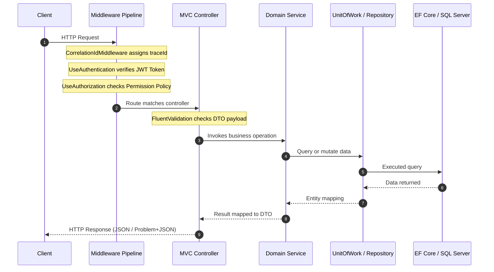

# Architecture & Design Principles

This manual documents the high-level architecture of `IXApi`, including request pipelines, layer dependencies, and security flows.

---

## 1. Architectural Style: Modular Monolith

`IXApi` is designed as a **Modular Monolith**. It runs as a single process (single deployment unit) but maintains logical separation of business concerns into distinct sub-modules. This prevents the codebase from becoming a tangled "ball of mud" while avoiding the operational complexity of microservices.

### The Six Business Modules
1.  **`Identity`**: Impersonation, token generation, user accounts, and claim-based security.
2.  **`Organization`**: Corporate entities, workers, departments, attachments, and announcements.
3.  **`Workflow`**: Processes, steps, execution tracks, performers, and variables.
4.  **`Finance`** (renamed from `ERP`): General Ledger, accounts payable/receivable, currencies, and tax.
5.  **`Communication`**: Realtime chat, alerts dispatcher, and notification channels.
6.  **`Administration`**: Auditing, database seeding, background jobs, settings, and number sequences.

---

## 2. Layer Responsibilities & Dependencies

The project uses a structured clean architecture layout internally:

```
[Presentation / API] ──> [Bootstrap / Composition] 
         │                         │
         ▼                         ▼
    [Modules] ────────────────> [Infrastructure]
         │                         │
         ▼                         ▼
    [   Shared / Stable Core Domain Kernel   ]
```

### Layer Rules
*   **Shared**: Contains stable primitives (`Entity`, `BaseEntity`, `SysEventBus`) and contracts. It **must not** reference API hosting, MVC controllers, or persistence implementations.
*   **Modules**: Contain pure business logic and feature entities. Each module has an explicit entry point (e.g. `FinanceModule.cs`) for registering its services.
*   **Infrastructure**: Implements database persistence (EF Core `ApplicationDbContext`, generic repositories), caching, SignalR hubs, and file storage.
*   **Presentation / Api**: Contains MVC Controllers, middleware, and request filters.
*   **Bootstrap**: The composition root (`Program.cs`, `DependencyInjection.cs`). It coordinates service registration.

---

## 3. HTTP Request Lifecycle

When a client hits an API endpoint in `IXApi`, the request passes through the following pipeline:



---

## 4. Security Flow

### Authentication Flow (JWT)
1.  **Request**: Client sends credentials to `api/v1/auth/login`.
2.  **Validation**: `AuthController` uses `UserManager<AspNetUser>` to verify credentials.
3.  **Token Generation**: `JwtTokenService` generates a JWT token containing:
    *   `sub` (User ID)
    *   `email`
    *   `claims` (System roles and permissions)
4.  **Verification**: For subsequent calls, the `JwtBearer` middleware validates the signature of the incoming token in the `Authorization` header.

### Authorization Flow (Dynamic Permission-Based)
1.  Endpoints are decorated with `[DomainPermission("Module", "Action")]` attributes.
2.  At startup, the `PermissionPolicyProvider` registers a dynamic authorization policy for the permission string.
3.  During execution, `PermissionAuthorizationHandler` parses the policy, extracts the required permissions, and checks if the authenticated user's JWT claims list contains the necessary permissions.
4.  If present, execution continues; otherwise, an `HTTP 403 Forbidden` response is returned.
