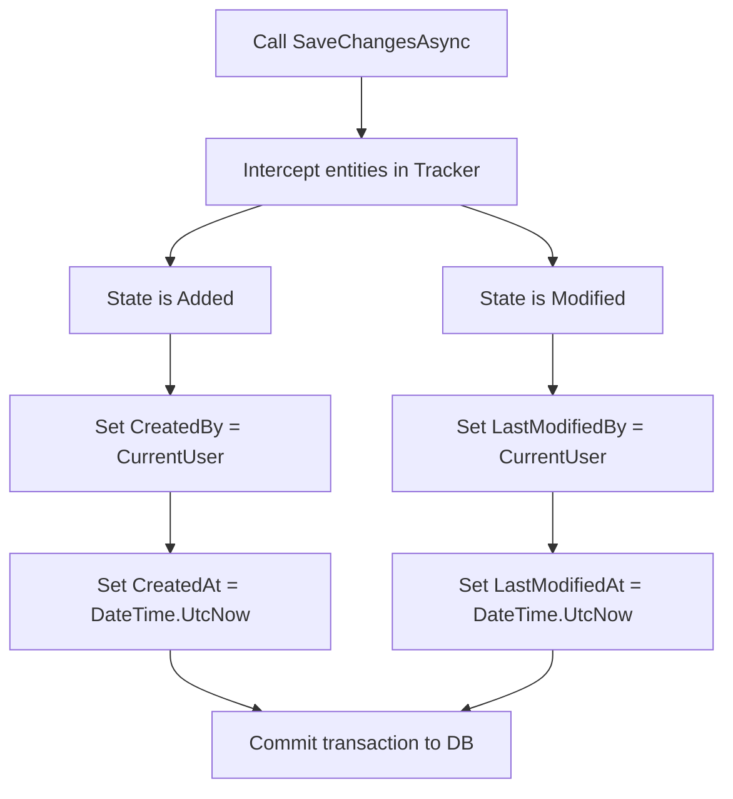

# Data Access & EF Core Schema

This manual documents the persistence layer, Entity Framework Core configuration, relationships, and seeding pipeline.

---

## 1. Persistence Layer Architecture

Data persistence in `IXApi` is built on **Entity Framework Core (EF Core)** using SQL Server as the backing store.

### The Unified DbContext (`ApplicationDbContext`)
The system uses a single database context (`ApplicationDbContext.cs`) located in `Infrastructure/Persistence/`. It contains the database sets (`DbSet<T>`) for all modules.
*   **Database Mapping**: Module entities are configured using fluent mapping inside individual configuration files (e.g. `HcmWorkerConfiguration.cs`) located near the entities.
*   **Global Filters**: Soft-deleted entities (where `IsDeleted == true`) are filtered automatically out of all queries using global query filters configured in `OnModelCreating`.

---

## 2. Shared Base Entity Definitions

All database models inherit from a common set of base primitives defined in the `Shared/Domain/Entities/` folder:

*   **`BaseEntity<T>`**: Contains the primary key (`Id` of type `T`), `IsActive`, and `IsDeleted` (soft-delete indicator).
*   **`Entity<T>`**: Extends `BaseEntity<T>` and implements `IMultiCompany`. It represents tables that contain multi-tenant partition fields (`Partition`, `DataAreaId`, `RecId`, `RecVersion`).
*   **`AuditableEntity`**: Extends `ICreatedBy`. It adds automated auditing fields (`CreatedBy`, `CreatedAt`, `LastModifiedBy`, `LastModifiedAt`) and links them to the `AspNetUser` identity record.

---

## 3. Automated Auditing Pipeline

The saving pipeline intercepts changes in `ApplicationDbContext.SaveChangesAsync()` to populate audit columns automatically:

---

## 4. Seeding Pipeline

To ensure a functional system on initial setup, the database has an incremental chunk-based seeder pipeline:

1.  **System Settings**: Populates basic app variables and constants.
2.  **Number Sequences**: Configures sequences for generating invoice numbers, purchase order IDs, and employee registration codes.
3.  **Security & Identity Roles**: Creates default administration, manager, and employee security profiles.
4.  **Legal Entities (Companies)**: Seeds default organization and fiscal setup parameters.
