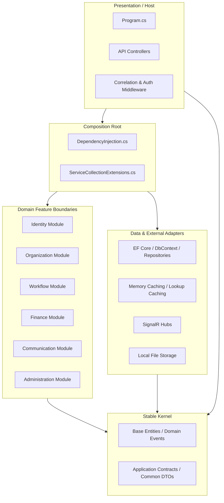

# IXApi System Documentation Portal

Welcome to the **IXApi** system documentation portal. This directory serves as a comprehensive knowledge base for developers, architects, and maintainers to understand the system's architecture, design patterns, folder structure, database mapping, and coding standards.

---

## 1. Documentation Map

The documentation is organized into six core structural manuals:

*   **[1. Architecture & Design Principles](ARCHITECTURE.md)**
    *   System style (Modular Monolith, DDD-lite, Clean Monolith).
    *   Request lifecycle & execution pipeline.
    *   Layer responsibilities & project dependency rules.
    *   Authentication & Authorization flows.
*   **[2. API Design & Communication](API_DESIGN.md)**
    *   Controller endpoints layout, DTO mapping, and model validation.
    *   Real-time communication using SignalR hubs.
    *   Standard response structures & exception filters.
*   **[3. Data Access & EF Core Schema](DATABASE.md)**
    *   EF Core DbContext configuration, entity properties, and relations.
    *   Database seeding pipeline.
*   **[4. Development & Coding Standards](DEVELOPMENT_GUIDE.md)**
    *   File, class, and method naming conventions.
    *   Dependency Injection configuration guidelines.
    *   Background services & hosted job execution.
    *   Caching system implementation details.
*   **[5. Code Quality Review & Refactoring Roadmap](REFACTORING_GUIDE.md)**
    *   Architecture critique, identified code smells, and technical debt log.
    *   Modular reorganization proposal.

---

## 2. Solution Overview

**IXApi** is an enterprise-level modular monolith built on **ASP.NET Core (.NET 9)**. It manages organizational hierarchies, workflow processes, finance (general ledger, accounts receivable, accounts payable), identity operations, and realtime communications.

### Core Projects
1.  **`IXApi.csproj` (Main Application)**: Houses the API hosting pipeline, controllers, modular feature boundaries, infrastructure layers, database schemas, and background job implementations.
2.  **`Tests/IXApi.Tests.csproj` (xUnit Test Suite)**: Validates security baselines, EF Core model configuration, and modular boundary compliance rules using `NetArchTest`.

---

## 3. High-Level Modular Monolith Diagram

