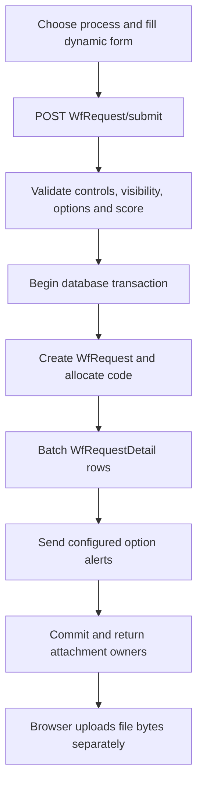

# Workflow architecture analysis and proposed direction

Date: 2026-09-10. Scope: the current IAX checkout, before implementation.

Second-pass review: [Arabic deep review and practical enhancements](workflow-deep-review-and-enhancements.md). Section 19 below records corrections to assumptions about persistence and runtime semantics.

## 1. Main conclusion and evidence boundary

The system is a modular enterprise application with an implemented dynamic request form, configuration CRUD, relational request details, historical workflow display, centralized notifications, and an assignment auto-pass job. **The current submission path does not execute the configured workflow.**

`WfRequestService.SubmitDynamicAsync` validates and saves a request and its details, optionally sends selected-option alerts, and returns attachment owner IDs. It does not initialize `WfProcessVariable`, evaluate `WfTransition`, select `WfStep`, resolve activity performers, or create `WfAssignment`.

The supplied descriptions of `WfRequestRepository.WfSendRequestAsync` and `WfSendRequestAsync2` describe a different/older implementation. Legacy submission code is present as reference text in `IXApp/docs/request.txt`, including the Integer/String evaluation calls and empty Boolean/DateTime branches. Neither method nor that repository was found in the current backend source. Do not base a refactoring on their assumed presence in the running application. Likewise, the XML-view conversion described in the attachment is not the current submission mechanism.

This report covers repository structure and dependency declarations, shared infrastructure, the workflow module's principal configuration/runtime/read paths, frontend submission and history, notification delivery, representative Finance conventions, and existing tests. It is a source-based architecture review, not a claim that every method in every unrelated ERP module has been behaviorally verified. A companion source inventory records the workflow files. No production database was queried, no workflow submitted, and no application source or database schema changed. External triggers/procedures or a differently deployed binary could add behavior not visible here; these require a deployment/database audit before migration.

## 2. Current project structure and dependencies

### Backend

`IXApi/IXApi.csproj` is the ASP.NET Core composition host targeting .NET 9. `Program.cs`, `Bootstrap`, and `Api` configure HTTP endpoints, authentication, company selection, logging, exception handling, and infrastructure. Separate projects exist for:

- `src/Shared`: entity bases, DTOs, CRUD contracts/base services/controllers, querying, validation, and events.
- `src/Infrastructure`: concrete `ApplicationDbContext`, repositories, unit of work, migrations, seeding, audit interceptor, and infrastructure adapters.
- `src/Modules/{Identity,Administration,Organization,Finance,Communication,Workflow}`: business capabilities and explicit module registration methods.
- `Tests`: xUnit, architecture, security/company, configuration, and characterization tests.

Declared backend packages include EF Core SQL Server 9.0.9, Mapster 7.4.0, FluentValidation 11.11.0, and ClosedXML 0.105.0 in Workflow. These are manifest observations, not recommendations to upgrade.

The architecture is a **modular monolith with one shared relational context**, not isolated module databases. Infrastructure references the module projects to construct the EF model. Workflow references Shared, Identity, Administration, Organization, and Communication. It does not reference the Infrastructure project. Some apparently infrastructure imports actually resolve to types compiled into Shared: for example `BaseService`, `IUnitOfWork`, and `ICurrentUserService` retain older namespace names. Assembly dependencies and namespace dependencies therefore tell different stories.

Within Workflow, entities, DTOs, validators, services, interfaces, controllers, and EF configurations are grouped by feature: `Processes`, `Steps`, `Activities`, `Performers`, `Requests`, `Variables`, `Transitions`, and lookup features. `Execution`, `Persistence`, `PrintTemplates`, and `DataExchange` already exist. This feature organization is worth retaining.

### Frontend

`IXApp` uses React 19, TypeScript, Vite, Material UI, Axios, TanStack Query, React Hook Form/Zod, Zustand, i18next, Vitest, and Playwright as declared in its package manifest. Its intended dependency direction is:

```text
app -> modules -> patterns -> shared -> core
```

`app` owns composition/routes/providers; `modules` own business behavior; `patterns` compose enterprise pages; `shared` supplies reusable controls/hooks; `core` owns transport, auth, errors, and localization infrastructure. Workflow APIs use the central client and typed response contracts. Process Builder is logically owned by Workflow while retaining `src/modules/process-builder`; the architecture audit explicitly recognizes that ownership.

The custom shared `DataGrid` composes hooks, body/header/toolbar, persistence, selection, editing, data processing, and responsive presentation. Do not rebuild it for workflow history. The open `shared/utilities/gridUtils.ts` is empty in this checkout; actual grid behavior is elsewhere, including `data-grid/DataGridUtils.ts`. The root README's MUI X grid and older module examples are not a reliable inventory of current implementation.

## 3. What happens when a user submits now

Evidence: `IXApp/src/modules/workflow/components/DynamicForm.tsx:252`, `api/dynamicRequestFormApi.ts`, and `IXApi/src/Modules/Workflow/Requests/WfRequestService.cs:330`.

1. The category/process selection page opens `WfRequestFromPage`. Its `DynamicForm` fetches `/api/v1/WfRequest/form-definition/{processId}`.
2. The backend loads an active process, active request controls, ordered options and validation rows. It interprets JSON `ExtendedProperties` into labels, layout, defaults, visibility, required/read-only behavior, and option features.
3. The browser validates visible controls and collects values, selected-option metadata, and files held in client state.
4. The browser POSTs JSON to `/api/v1/WfRequest/submit`. File bytes are not part of this transaction.
5. `WfRequestController.SubmitDynamic` calls `IWfRequestService.SubmitDynamicAsync`.
6. The service reloads the form, rejects duplicate/unknown control IDs, replaces read-only values with configured defaults, computes visible controls, validates options and required file metadata, enforces length/rules/uniqueness checks, and calculates score.
7. It constructs `WfRequest`, including process name/description, UTC date, company, score, active state, and zero progress. `RequestDetails` receives descriptive text, not newly generated XML.
8. Within the EF execution strategy and a unit-of-work transaction, `OnBeforeAddAsync` resolves the authenticated user's active `HcmWorker` where available and obtains a request code from the existing number-sequence service.
9. It saves the request to obtain `RecId`, then batches ordinary control details and selected-option file-metadata details into `WfRequestDetail` rows and saves them.
10. For selected options configured to send an alert, it loads static `WfPerformerUsers`, converts their numeric IDs to strings, and calls `ISysNotificationService.SendToUsersAsync`. This is option-driven alerting, not activity assignment.
11. It commits and returns request ID/code/score plus detail IDs to use as attachment owners.
12. The browser separately uploads request/control/option files through `documentApi`. It waits for all uploads and reports any failures while retaining the saved request.



**Missing from this path:** variable initialization/mapping, transition evaluation, first-step selection, assignments, activity completion, next-step progression, and request completion through a generic execution coordinator. Submission success currently means form persistence succeeded; it does not prove a task reached an employee.

## 4. Configuration versus runtime

Configuration entities include `WfProcess`, `WfStep`, `WfActivity`, `WfPerformer`, `WfPerformerUsers`, `WfVariable`, `WfTransition`, `WfTransitionTrigger`, operators/data types, request/activity control definitions, options, validation definitions, and control-variable mapping definitions.

Runtime entities include `WfRequest`, `WfRequestDetail`, `WfAssignment`, `WfActivityDetail`, `WfProcessData`, `WfProcessVariable`, `WfRequestVariable`, and transfer/request-transition records. Central `SysNotification` entities belong to Communication.

The configuration chain remains meaningful:

```text
WfProcess -> WfStep -> WfActivity -> WfPerformer -> employee resolution
                         |
                         + configured channels/template

WfVariable <- request/activity mappings
     |
WfTransition -> target step
```

However, models and CRUD screens alone do not implement the arrows at runtime. `WfTransitionService`, `WfVariableService`, and `WfStepService` are configuration services, not evaluators or execution services. `WfTransitionDtoValidator` requires a positive `StepId`; therefore the pasted `StepId = 0` completion convention is not accepted by this configuration validator. Neither `-1` fallback nor first-match routing is established as current runtime behavior.

`WfStep.MustCompleteAll` exists and should inform an explicit progression policy. Do not assume all activities are sequential, or that completing any one assignment advances the step. Multiple recipients of one activity require a separate, documented completion rule.

## 5. Responsibilities of current components

The companion inventory lists files by feature. The following describes actual responsibilities and important exceptions to the standard family pattern.

- `WfRequestController`: HTTP request list/detail/update/delete, form definition, dynamic submission, validation, and mail detail endpoints. Generic create/bulk routes are disabled with `NonAction`. Access checks for reads and mutations currently share `CanAccessRequestAsync`.
- `WfRequestService`: form-definition assembly, runtime JSON parsing, validation/visibility/scoring, request/detail persistence, option alerts, requester enrichment, XML compatibility, and history projection. Its authorization partial resolves account/employee/request access. This is the largest responsibility concentration in the submission path.
- `ValidationEngine` / `IValidationEngine`: separate server-side validation used by `/validate`; includes configured database-existence checks and expression evaluation. Submission does not call this engine.
- `WfProcessService`: CRUD/number generation, include customization, and synchronization of process eligibility rows (`WfUsersProcess`).
- `WfPerformerService`: configuration CRUD and number generation. `WfPerformerController` additionally persists performer-user relationships directly through the unit of work and exposes a hard-coded legacy SQL schema list. It does not resolve performers for assignments.
- `WfStepService`, `WfActivityService`, `WfVariableService`, `WfTransitionService` and lookup services: largely generic CRUD with number-sequence hooks. Preserve these for configuration.
- Request/activity control, option, validation-definition, and mapping services: thin CRUD wrappers over existing generic infrastructure. Their validators validate configuration DTOs; that is distinct from evaluating submitted values.
- `WfActivityNotificationDispatcher`: selects activity channels, resolves a template, and delegates delivery to Communication. This is an existing reusable integration point.
- `WfActivityAutoPassJobHandler`: queries up to 200 overdue open assignments, marks them finished, saves, and publishes an event per assignment. It does not create process data, evaluate transitions, or finish/advance the parent request.
- `WfAssignmentAutoPassedNotificationHandler`: loads the activity and dispatches an alert for the event. Other activity alert events/handlers supply notification-related integration, not a complete execution pipeline.
- `PrintTemplateService`, document validator, and resource authorizer: template CRUD/versioning/publication and authorized selection for process/request/record reporting. Keep this reporting subsystem separate from workflow execution; its versioning is not workflow-definition versioning.
- `WfExcelImportService`: imports configuration from fixed spreadsheet columns and exports templates. Writes repositories directly, bypassing normal configuration service hooks; it is not an automatic request-submission engine.
- `IWorkflowDataContext`: EF-facing module persistence port with DbSets, generic `Set`, metadata, database access, and saves. `ApplicationDbContext` implements it.
- `BaseController`, `BaseService`, `GenericRepository`, `UnitOfWork`: common HTTP CRUD/mapping, service hooks/querying, EF staging/query access, and save/transaction operations respectively.
- `AuditInterceptor`: audit fields, soft-delete transformation, original-value hydration, and audit persistence around saves.
- `SysNotificationService`: recipients/preferences/templates, notification persistence, channel delivery, delivery audits, and realtime counts. `SysEventBus` resolves subscribers in-process and logs subscriber failures.
- Frontend `DynamicForm`: rendering state, visibility/validation/scoring, submission, and attachment uploads. `WfRequestFromPage` wraps it; `WfMailPage` displays request/history/documents; typed workflow API adapters handle transport. Shared dynamic control rendering and page/grid/document components provide reusable presentation infrastructure.

## 6. Persistence, DI, transactions, errors, logging, and async

DI is constructor-based and predominantly scoped. `WorkflowModule.AddWorkflowModule` explicitly registers services, notification handlers, and the job handler. Host infrastructure maps all module context interfaces to the same scoped `ApplicationDbContext`, allowing request and notification database rows to participate in the same transaction. Explicit registrations are the reliable evidence; comments referring to automatic scanning are not sufficient after the assembly split.

EF entity classes use `RecId`, `DataAreaId`, audit fields, `IsActive`, soft deletion, `RowVersion`, and `RecVersion`. Configurations map legacy table/column names; some keys map to names such as `TransitionId`. SQL Server is configured with retry-on-failure. Module EF configurations are applied centrally. Global filters cover soft deletion and company-scoped entities, with named shared-party exceptions. Global model logic converts cascade deletes to restrict even where a local configuration requests cascade.

Important exception verified in the second pass: `WfProcessVariableConfiguration` ignores `RowVersion`, `IsActive`, and `SortOrder`; performer membership ignores `RowVersion` and `IsActive`. Request mapping `SortOrder` and activity mapping `VariableOrder` are also ignored. Entity inheritance does not guarantee those fields are persisted or that every runtime write has optimistic concurrency protection.

Services mix generic repositories with module-context queries. This is already the local pattern; adding a repository per table would duplicate existing infrastructure. Read paths frequently use `AsNoTracking`; mutation paths rely on tracking. Raw SQL is present for party display-name lookup and configured existence validation. Raw SQL does not automatically inherit entity query filters.

`BaseService.AddAsync` and other CRUD writes call `CompleteAsync` internally; they are not all staging-only methods. `UnitOfWork.CompleteAsync` calls `SaveChangesAsync`, includes a deadlock retry loop, and converts concurrency failures into `InvalidOperationException`. Submission calls saves twice for generated request/detail IDs, not once per detail. Those two saves remain within one outer transaction and have a practical purpose.

Errors are mixed: ordinary controllers return `APIResponse<T>`; dynamic submission converts control errors to a concatenated message; `/validate` returns `{ success, errors }`; the global exception handler returns ProblemDetails and records exceptions. FluentValidation validates DTOs, while custom engines evaluate form rules. Standardize semantic error codes and field details without breaking existing clients suddenly.

Logging uses `ILogger`, structured arguments, console/debug providers, correlation middleware, database exception records, and audit logging. Runtime routing decisions currently have no execution trace because the routing pipeline is absent. Future traces should record request/assignment/configuration IDs and outcomes, not full submitted form contents by default.

Most current service I/O is asynchronous with cancellation tokens. Legacy `ValidationEngine` and Excel import signatures omit cancellation; regex evaluation in the old validator has no timeout, unlike the submission helper's 250ms timeout. In-process events are sequential and non-durable. Never parallelize queries against the same scoped EF context when batching lookups; load sets sequentially and evaluate in memory.

## 7. History and stage data

`GetMailDetailsAsync` loads authorized request data, relational details, XML compatibility values, assignments with activity/step configuration, and `WfActivityDetail` rows. It resolves employee names and projects tracking entries. New request labels are obtained from current control configuration; legacy XML may supply additional labels/values.

The current DTO projects one display date (`FinishedDate ?? AssignDate`), stage/title/responsible/action/notes and status flags. Only the latest assignment can be marked `IsCurrent`, even if several assignments remain open. `WfMailPage.tsx:453` chooses the badge text from `isCurrent` alone, showing every other entry as completed even when `isCompleted` is false: this is a confirmed display-logic defect for concurrent open assignments. It does not build the full requested stage aggregate from `WfProcessData`, and it does not expose both assignment and completion dates in each tracking entry. Request/detail documents are loaded separately in the frontend.

Recommended read model: original request fields/documents plus stage occurrences containing all assignments, performer identity, assigned/completed dates, outcome, structured activity controls, and attachment references. Group by execution occurrence, not only configured `StepId`, because a process may revisit a step. Preserve parallel pending activities. Snapshot labels/configuration identity where historical accuracy requires it. Do not derive task state from whichever assignment happens to be latest.

## 8. Findings classified by certainty and impact

### Confirmed implementation gaps / architectural issues

1. **Workflow configuration is not connected to dynamic submission execution.** No variable/routing/assignment stages exist in `SubmitDynamicAsync`; assignment creation found in seed paths is not runtime submission. Implementing these stages is a feature addition.
2. **Auto-pass finishes assignment records without progressing the workflow.** The job/event handlers examined do not perform routing or completion aggregation.
3. **Multiple validation semantics exist.** Submission, `/validate`, and frontend validation differ. For example, legacy `filesize`/`fileextension` cases return true, while submission checks file metadata; `exists` and `daterange` are implemented in the old engine but fall through submission's default-true branch. Unknown submission rules silently succeed. Treat accepted configuration semantics as a compatibility decision, then eliminate silent unsupported-rule success.
4. **Read access is reused for update/delete authorization.** `CanAccessRequestAsync` allows requester/creator/assignee or view-all permission; the controller uses it for mutations too. Whether assignees should edit/delete requests is a business/security policy decision, but read and write capabilities need separate contracts.
5. **Definition eligibility is not enforced in the submission method.** It requires an active process, but does not evaluate `WfUsersProcess` eligibility. Confirm the intended eligibility policy and enforce it at the server execution entry point, not merely in a process selector.
6. **Performer membership writes are split across saves without a surrounding transaction in the controller.** Failure syncing users can leave saved configuration with incomplete membership.
7. **Frontend dependency audit currently fails.** Three Finance pages import `app`, and `shared/components/logistics/PartyLogisticsPanels.tsx` imports `patterns`. The architecture document's clean-audit assertion is stale.

### Reliability concerns with concrete failure paths

8. **Notifications are delivered before request commit.** `SendAsync` saves rows then calls channel senders/realtime; outer rollback cannot retract a delivered alert. Retry can send duplicate alerts. Persist delivery intent in the same transaction and dispatch after commit through a durable worker.
9. **Submission has no idempotency key.** A lost success response or repeated POST can create another request. The request object is also constructed outside the EF retry delegate and reused after prior saves; tracked state/generated IDs and ambiguous commits require deliberate retry handling, not an assumption that retry-on-failure solves this.
10. **Uniqueness check is a read-before-write outside the transaction.** Concurrent submissions can pass together. Design a database-backed reservation/constraint for configured unique values with explicit company/control/normalization scope; do not impose uniqueness on every detail row.
11. **File metadata and actual attachments can diverge.** Required metadata is validated before separate uploads. The existing frontend explicitly permits saved requests with failed uploads. Preserve this behavior during extraction; separately decide whether mandatory attachments must block engine activation using upload staging/finalization.
12. **Event delivery is not durable.** Auto-pass saves first and then publishes. A crash between those operations loses the notification, and the next scan excludes finished assignments. Subscriber errors are logged and swallowed; the bus is unsuitable as the only reliable progression mechanism.
13. **Nested transaction ownership and cancellation need explicit handling.** `BeginTransactionAsync` silently skips creation if one exists; commit/rollback use the unit-of-work field. A common coordinator should own the boundary. Cleanup with an already-canceled request token can also fail; use disposal and controlled cleanup in the implementation design.

### Potential bugs requiring focused verification

14. **Employee/account ID mismatch in notification paths.** History interprets `WfAssignment.UserId` as `HcmWorker.RecId`, while auto-pass sends that numeric value as a notification account ID. Option alerts also stringify `WfPerformerUsers.UserID`. Confirm stored membership semantics; resolve employee IDs to `HcmWorker.UserId` before account-based delivery where required.
15. **Company scope in configured existence checks.** `ValidationEngine.CheckDatabaseExistenceAsync` validates mapped table/column names and parameterizes values, but its raw SQL omits company/soft-delete predicates. It is not arbitrary unchecked SQL, yet it can test records outside the intended scope.
16. **Hour-boundary SLA calculation.** `DateDiffHour` counts hour boundaries; it may auto-pass before the full configured duration has elapsed. Confirm whether policy means elapsed duration or clock-hour boundaries before changing it.
17. **Mutable configuration alters history.** Current labels and activity/step names are read from live configuration; deleting/changing definitions can change historical presentation. Required-navigation query filters also deserve tests.

### Performance and maintainability debt

18. `GetRequestListAsync` materializes all company-visible requests before authorization filtering; apply access predicates and pagination in SQL.
19. Form uniqueness checks issue one query per unique control. Form assembly and history repeatedly filter in-memory collections; use grouped dictionaries. Notification sends add saves/channel work per alert and recipient. Audit hydration may query original values for each changed entity. Measure actual query counts before deciding on indexes/caching.
20. Runtime/configuration records share folders (`Processes` contains variables/data; `Activities` contains activity details). Shared physical paths and historical namespaces disagree. Mixed `UserID`/`UserId`, `AssignmentID`/`AssignmentId`, `Activated`/`IsActive`, block/file-scoped namespaces, and singular/plural names complicate navigation.
21. `WfRequestVariable` and `WfProcessVariable` overlap structurally, but no evidence establishes they are interchangeable. Inventory deployed data and consumers before merging or removing either.
22. `GetSqlSchema` advertises hard-coded legacy organization names while the current model uses `HcmWorker` and `HcmWorkerManager`. Do not implement a SQL resolver by trusting that catalog.
23. `WfActivityAlertDispatchedEventHandler` and `WfActivityNotificationDispatcher` duplicate template resolution and notification DTO construction. Consolidate the construction/delivery adapter while preserving the event's explicitly supplied channels versus the dispatcher's activity-configured channels.

## 9. What to preserve

- Feature-based modular monolith, existing projects, API routes, `Wf` names, entity keys/table mappings, company boundaries, and audit/concurrency foundations.
- Dynamic form definitions, generic controls/options, scoring/visibility behavior, Arabic/English labels, RTL presentation, shared page/grid/lookup/document components.
- Current generic repository/unit-of-work infrastructure and module context ports; existing number-sequence hooks.
- Configuration CRUD services, explicit DI registration, and existing request/result DTOs while callers transition.
- Communication channel strategies, template/preferences/audits, activity notification adapter, Administration job infrastructure.
- Legacy XML **read compatibility** and seeded-history/reporting support until data migration is separately validated.
- Existing relational `WfRequestDetail` writes. Do not reintroduce an XML-view write dependency just to match the supplied sketch.

Design intent inferred from these choices: compatibility with legacy ERP data, company isolation and auditability, generic configurable forms, and a gradual move toward modular code. That interpretation is supported by mappings/comments/seeding; it is not a claim about undocumented author decisions.

## 10. Recommended architecture fitted to this project

Keep the existing feature folders and add focused runtime capabilities within them. Do not add parallel `Application/Domain/Infrastructure/Services/Repositories` trees to every feature.

```text
Workflow/
  Requests/       request API/facade, form definitions, submission validation
  Execution/      coordinator, execution/result contracts, assignment lifecycle
  Variables/      configuration CRUD + runtime variable initialization/mapping
  Transitions/    configuration CRUD + pure transition evaluation/routing policy
  Performers/     configuration CRUD + performer resolution
  Activities/    configuration CRUD + existing notification adapter
  Steps/         configuration CRUD
  Processes/     configuration CRUD
  Persistence/   existing EF-facing context port
  PrintTemplates/ existing reporting subsystem
  DataExchange/  configuration import/export
```

Initially leave entity files where they are. Only after callers/tests are stable, move clearly runtime files into `Execution` if navigation benefit justifies namespace churn. Keep table/column mappings stable. A separate read service is preferable to moving runtime state into reporting code.

Minimal useful responsibilities, added incrementally:

- `IWfExecutionService` / `WfExecutionService`: the single transaction-owning use-case coordinator. Expose `SubmitAsync` and later `CompleteAssignmentAsync`; background callers use the same application operations with an explicit company/actor context. This is the one essential new application boundary for execution.
- `WfRequestFormService`: extract current form-definition assembly, metadata interpretation, and normalization when separating it from submission. A separate interface is useful only for a real consumer/testing boundary.
- `WfRequestValidationService`: one authoritative server evaluator used by both submit and validate. Retain `IValidationEngine` as an adapter during migration. Pure visibility/value/rule helpers need no interface each.
- `WfVariableInitializer`: batch loads relevant variable/mapping definitions and creates initial runtime values from normalized controls. Reuse `WfProcessVariable` pending the data-model decision; do not introduce a third variable table.
- `WfTransitionEvaluator`: pure typed conditions over supplied values. Return an explicit routing result such as selected step, complete, or no match, with matched transition identity. Unsupported types/operators/configuration produce a diagnosable error, not successful comparison.
- `IWfPerformerResolver` / `WfPerformerResolver`: batch-resolve applicant/request field/static employees and manager levels. Reuse Organization's `HcmWorkerManager` (`EmployeeId`, `ManagementLevelId`, `ManagerId`) rather than rebuilding four manager lookups. Start with one resolver; split strategies when new independent implementations actually warrant them. Define employee identity separately from notification account identity.
- Assignment creation can start as a cohesive coordinator helper producing a batch of entities. Add a dedicated assignment service only when completion, reassignment, and deduplication justify it.
- Reuse `IWfActivityNotificationDispatcher` and Communication's channels. Introduce durable delivery intent/outbox support in Communication, not a competing Workflow email/SMS stack. Verify whether existing notification pending state can be extended; the current sender does not provide transactional deferred delivery.
- `WfRequestQueryService` can receive list/mail/history projections when removing read responsibilities from the request facade. Keep legacy XML conversion behind a focused compatibility parser.

Only the executor, authoritative validation boundary, and real external-resolution/delivery seams need interfaces at first. Pure evaluators/value normalization can be concrete classes or functions. No mediator framework, event sourcing, microservices, or replacement ORM is required.

Dependency direction: controllers/jobs -> Workflow application operations -> pure rule/value evaluation plus existing persistence and module integration contracts. Infrastructure supplies the concrete context. Communication owns delivery; Organization owns employee/manager data. Pure routing must not query SQL, send notifications, access HTTP, or depend on a process-specific Finance/permit/license class.

## 11. Proposed execution semantics

For a future generic submission operation:

1. Authorize actor/company/process eligibility and load an internally consistent active definition.
2. Normalize and validate fields/attachments using the authoritative form rules.
3. Establish idempotency and definition identity; start the transaction owned by the coordinator.
4. Persist request and normalized details, preserving required identity-generating saves.
5. Initialize typed runtime variables and apply configured request-control mappings.
6. Evaluate ordered start transitions, with stable tie-breaking and explicitly agreed no-match/completion behavior.
7. Load the selected step's active activities and batch-resolve performers.
8. Fail with a configuration error if a required activity has no valid performer; do not silently leave an unassigned request.
9. Create assignment batches with company, activity, step, employee, assignment time, and copied runtime SLA settings.
10. Persist notification intents alongside state, commit, and return request/status/current assignments. Deliver channels asynchronously afterward with deduplication/retry.

For completion, the same executor validates actor and row version, writes activity controls/process data, updates variables, finishes the assignment, applies activity/step aggregation, evaluates next transitions, and stages subsequent assignments or request completion in one transaction. Idempotency must prevent the same completion from advancing twice. The auto-pass job supplies a timeout outcome to this operation instead of directly changing `IsFinished`.

Do not silently select defaults for these business rules: first matching transition versus multiple matches; no-match behavior; completion sentinel; `MustCompleteAll` semantics; multiple recipients per activity; repeated steps; rejection/return/cancellation; missing manager behavior; required attachments before activation; repeat interval eligibility; and whether an active request follows a snapshot or latest definition. A small workflow-definition snapshot/version reference should be designed before production execution relies on mutable configuration. Existing report versions are not a substitute.

SQL performers should remain explicitly unsupported until an allowlisted, parameterized, company-scoped query contract with a defined employee-result shape is agreed. Arbitrary configurable SQL must not become the generic extension mechanism. Permit/license/payment integrations should provide configured inputs and typed outcome handlers while routing and assignment logic stay generic.

## 12. Current-to-proposed mapping

- `WfRequestService.SubmitDynamicAsync` -> retained API-compatible facade -> `WfExecutionService.SubmitAsync`. Extract current persistence first; add missing routing as a separately tested feature.
- `GetFormDefinitionAsync` and metadata/control helpers -> `WfRequestFormService`; preserve DTO/layout behavior.
- `ValidateRules`, visibility/value helpers, and `ValidationEngine` -> shared authoritative validation plus compatibility adapters. Record differences before choosing behavior.
- Request/detail construction -> executor staging helper + existing repositories; no new request repository by default.
- Missing initialization/mapping -> `WfVariableInitializer` using existing configuration/runtime entities.
- `WfTransitionService` -> remains configuration CRUD; new `WfTransitionEvaluator` supplies runtime behavior.
- `WfPerformerService` -> remains configuration CRUD; move controller membership sync into it with an atomic configuration save. New resolver handles runtime employee resolution.
- Inline option alert lookup -> reusable performer resolution plus staged Communication delivery; preserve distinct option-alert and assignment-alert semantics.
- `WfActivityNotificationDispatcher` -> preserved adapter, connected to deferred delivery rather than synchronous transport inside execution transactions.
- `WfActivityAutoPassJobHandler` direct updates -> `CompleteAssignmentAsync` with timeout/system actor; retain job scheduling/batching infrastructure.
- `GetRequestListAsync` / `GetMailDetailsAsync` -> query service, authorized SQL filtering and structured stage projections.
- XML parsing/merge methods -> compatibility helper used only by reads/imports until migration is complete.
- `WfProcessService`, lookup/control CRUD, EF configurations, report/template subsystem, and generic frontend components -> remain, with targeted fixes rather than wholesale replacement.
- `WfSendRequestAsync` / `WfSendRequestAsync2` -> no current mapping beyond historical reference; neither exists here to consolidate.

## 13. Naming standard

Use `Wf` consistently for Workflow-owned types, `IWf...` for new interfaces, singular entity names, `...Dto` for API contracts, `...Configuration` for EF maps, `...DtoValidator` for configuration DTO validation, and `...Async` for asynchronous I/O methods. Use meaningful verbs (`SubmitAsync`, `CompleteAssignmentAsync`, `ResolveAsync`) rather than numeric method suffixes. Keep pure evaluators synchronous.

For new members use `Id`, not `ID`; distinguish `EmployeeId` from `AccountUserId`; use `IsActive`, `SortOrder`, and UTC timestamps consistently. Preserve existing public names/serialized fields and EF column mappings during migration. Rename `WfRequestFromPage` to `WfRequestFormPage` only as a compatibility-preserving cleanup, not a prerequisite for an engine. Align namespaces to physical ownership in a separate cross-project change; namespace-only architecture tests currently miss some Shared types with legacy namespace names.

Use `WfSubmissionResult` internally if runtime results need more than the existing `SubmitDynamicRequestResultDto`; adapt at the controller boundary and extend the public DTO compatibly. Return assignment IDs/status and notification intent state, not transport-specific lists of emails/SMS. Do not report queued messages as delivered.

## 14. Incremental implementation plan and verification gates

1. **Baseline:** retain this report, inventory and current tests; capture representative deployed definitions/data without mutation. Verify migration history, actual constraints/triggers/views, employee/account mappings, and legacy runtime consumers. Separate pure extraction from missing behavior work.
2. **Characterize:** add focused service tests for current normalization, defaults, hidden controls, option files, scoring, request/detail atomicity, company access and XML history. Document validation disagreements explicitly.
3. **Extract:** move pure helpers and form/history responsibilities behind the existing facade. No routing behavior change. Existing API/UI tests and source contract comparisons must pass.
4. **Reliability foundation:** unify server validation, separate read/write authorization, enforce eligibility, define transaction ownership/idempotency, and stage notifications durably. Test simultaneous unique submissions, lost responses, retry after a save, notification failure, and company isolation using a relational SQL Server test database.
5. **Runtime submission:** implement variable mapping, typed routing and employee resolution over existing tables; connect assignments to submission. Validate fallback/completion/multi-recipient rules using configuration fixtures. Add Boolean/date/decimal operators through the same evaluator, not process branches.
6. **Completion:** add assignment outcomes, data/attachments, variable updates, step join/progression and terminal state. Connect timeout processing and subsequent automatic triggers to the same coordinator. Test competing completions and duplicate jobs.
7. **History:** expose all stage occurrences, both timestamps, completed controls/documents and every pending assignment. Test repeated steps, parallel activities, altered configuration and legacy requests.
8. **Optimize and tidy:** batch queries, measure query counts/plans, add justified indexes, align selected names/folders and remove legacy paths only after consumers/data migration are proven. Keep unrelated grid/Finance changes out of the engine implementation.

A behavior-preserving refactor ends after extraction. Enabling new assignments/progression must be reviewed and released as an explicit feature with rollback capability, because users currently receive saved requests without that execution.

## 15. Verification performed

- Source searches traced current submission, assignment creation, variable/transition consumers, execution handlers, history and central notification delivery. No `WfSendRequestAsync`, `WfSendRequestAsync2`, or `WfRequestRepository` implementation was found.
- Frontend `DynamicRequestForm.test.tsx`: **17 tests passed**. These verify form behavior, not end-to-end workflow routing.
- Frontend architecture audit: **failed with four new forbidden edges**: `CustomerListPage`, `SalesOrderDetailsPage`, `SalesOrderListPage` -> `app`; `PartyLogisticsPanels` -> `patterns`. The audit also reported four known layer-debt edges. No fixes were made.
- Backend focused architecture/workflow/company checks: **34 passed, zero failed/skipped**. The first build attempt was blocked by DLLs held by the running `IAX.IXApi` process; retrying into a separate output directory succeeded without stopping that process. Existing migration-name and unreachable-seeder warnings remain. These tests do not establish runtime routing support.
- No live database behavior, production delivery, or performance benchmark was claimed. Existing `WorkflowRequestFormIntegrationTests` cover DTO inheritance and a transition validator; their name does not imply a database-backed submission integration test.

## 16. Transition and variable evaluation: detailed review and AND/OR design

This section incorporates the additional requirement for configurable AND and OR evaluation. It is a proposed design, not an implemented change.

### Actual type support: distinguish three different layers

**Current application runtime:** no transition evaluator is connected to submission. Therefore Integer, String, DateTime, and Boolean workflow-routing evaluation are all unimplemented in that path. Numeric/string form validation is not evidence of a workflow transition engine.

**Legacy reference text:** `IXApp/docs/request.txt:397` and `:1300` contain duplicated evaluation loops:

- Integer: obtains a nonempty runtime variable value, converts both sides with `long.Parse`, and calls `Helper.ValidateValues<long>` by type inference. Invalid integers, decimals, or Int64 overflow can throw. There is no explicit decimal branch.
- String: obtains a nonempty runtime variable value and calls `Helper.ValidateValues<string>`. The caller does not establish case sensitivity, collation, culture, or which string operators work.
- Boolean and DateTime: branches exist but are empty. They do not evaluate or select a step.
- Missing/empty runtime values are skipped for both implemented call paths. Consequently an empty runtime string never reaches the helper, regardless of whether the helper might support an empty-value operator.
- `ValidateValues<T>` is **referenced but its implementation was not found** in the source/reference text searched. Its operator support, range syntax, null behavior and generic constraints cannot be certified from those calls. Do not recreate it from assumptions about its name.

**Configuration/designer:** `WfDataType`, `WfVariable`, `WfOperator`, and `WfTransition` store type references, operator references, comparison text, and ordering. Process Builder validates some comparison text, but it does not execute transitions against request runtime values.

### How variables and transitions are intended to connect

```text
WfVariable.DataTypeId -> WfDataType semantic type
WfRequestControl -> WfRequestMappingVariable -> WfVariable
WfActivityControl -> WfActivityMappingVariable -> WfVariable
WfProcessVariable(RequestId, VariableId).VariableValue -> actual value
WfTransition.VariableId -> which actual value to read
WfTransition.OperatorId -> comparison operation
WfTransition.Value -> expected operand text
typed comparison result -> transition match -> target StepId
```

The legacy code initializes active process variables ordered by `VariableOrder`, chooses only the first active mapping per control ordered by `VariableOrder`, writes values, then evaluates transitions only when `hasVariable` is true. This means ordering and existence of a mapping can affect whether routing runs at all; multiple mappings are not all applied. Each transition queries its runtime value again. Preserve this only when explicitly adopting legacy behavior, not as a presumed requirement.

The current model uses `SortOrder` for variables, transitions and request mappings, but retains `VariableOrder` for activity mappings. Define separate purposes: transition order chooses route priority; mapping order determines precedence only if multiple writes are intentionally allowed; group/condition order determines display and evaluation order. Variable display order is not route priority.

### Confirmed configuration inconsistency: data type IDs

`WfProcessSeedData.MasterData.cs:193` seeds:

- ID 1, code `INT`: Integer (legacy display name is misspelled `Integre`).
- ID 2, code `STR`: String.
- ID 3, code `DT`: DateTime.
- ID 4, code `BOOL`: Boolean.

`processBuilderApi.ts:34` instead reads ID 1 as text, 2 as number, 3 as boolean, and 4 as date. Its write mapping makes the corresponding reversed assignments; `object` writes ID 1, while its read mapping only produces object for ID 5. This is a confirmed source-contract mismatch against the supplied seed. The actual deployed catalog still needs inspection before repairing stored variables.

Resolve type IDs from a canonical, validated type code contract. Keep existing IDs stable and supply explicit aliases for legacy codes. Do not silently change stored IDs or infer types from editable display names. Distinguish Integer and Decimal rather than collapsing both into JavaScript `number`; transmit large Int64/decimal operands as strings and parse authoritatively on the backend. The separate reporting types (String/Integer/Decimal/Date/DateTime/Time/Boolean) are reporting metadata, not evidence those workflow types execute today.

### Operator support and partial combinations

Backend seeds declare `GT`, `LT`, `GTE`, `LTE`, `EQ`, `NEQ`, and `BETWEEN`. Builder's union additionally offers `contains` and `isEmpty`. These names do not establish executable runtime support. If the corresponding operator is absent from the catalog, save may reject it. `builderOperator` falls back to `=` for unknown values, so unknown operator metadata can also be displayed or matched misleadingly. Reject unknown codes explicitly.

Current builder `validateTransitionValue` checks finite JavaScript numbers, exact `true`/`false`, date-only `YYYY-MM-DD`, and parseable JSON objects. It does not validate a type/operator compatibility matrix. Important gaps:

- Number checks accept decimal numeric syntax, whereas the legacy numeric branch accepts only Int64 values.
- Date input is date-only, despite the backend seed type being DateTime; no timestamp/time-zone comparison policy exists.
- Boolean ordered comparisons and String numeric ordering are not rejected by a typed backend evaluator because that evaluator is absent.
- `BETWEEN` is declared, but transitions hold one `Value` and the designer has no structured lower/upper operand contract. A range such as `10,20` fails its numeric scalar validation; a single number cannot define both bounds.
- `contains`/`isEmpty` are designer possibilities but not among the seven seeded operators. The legacy nonempty guard prevents evaluating empty actual values.
- Object has no matching seeded workflow type or defined comparison semantics.
- Submission's form comparison helper opportunistically parses decimal operands; it must not be reused as typed workflow evaluation without removing that coercion. A numeric-looking String must remain a String when the variable is declared String.

Recommended supported matrix for the new evaluator, explicitly **target behavior**:

- Integer and Decimal: equality, inequality, ordered comparisons, inclusive Between with two operands.
- String: equality, inequality, Contains and explicit empty/present checks; choose and document case sensitivity. Do not offer numeric ordering by default.
- Boolean: equality/inequality with canonical true/false. Reject Contains, ordered comparisons, and Between.
- DateTime: equality and ordered/range comparisons on normalized instants; require an offset/UTC contract. Date-only should be a separate defined type or an explicit date-only policy.
- Missing/null and empty String: model distinctly; operators decide permitted usage. Invalid parsing or missing configuration is an evaluation error, not ordinary false and not a fallback route.
- Object: unsupported until concrete comparison requirements justify it.

### Configurable AND and OR: recommended model

Keep `WfTransition` as one route with its process/trigger scope, destination step, priority and active state. A transition owns **one root condition group**. Add two focused child entities within `Workflow/Transitions`:

- `WfTransitionConditionGroup`: existing entity metadata (`RecId`, company, audit/concurrency fields), `TransitionId`, optional `ParentGroupId`, `EvaluationMode` (`All` or `Any`), and `SortOrder`.
- `WfTransitionCondition`: entity metadata, `GroupId`, `VariableId`, `OperatorId`, first operand `Value`, optional second operand `ValueTo` for Between, and `SortOrder`.

User-facing labels: **All conditions (AND)** and **Any condition (OR)**. Do not add AND/OR to `WfOperators`; those operators compare operands, whereas AND/OR combine condition results. Do not put one evaluation flag on the entire process: different routes need different combinations.

One group is enough for simple requirements:

```text
Transition: send to Finance approval
Evaluation: All conditions (AND)
  Amount > 10000
  Department = Finance

Transition: send to urgent review
Evaluation: Any condition (OR)
  IsUrgent = true
  Amount > 50000
```

Nested groups support both modes without ambiguous precedence:

```text
Transition: send to senior approval
All conditions (AND)
  Amount > 10000
  Any condition (OR)
    Department = Finance
    Department = Legal
```

The last rule means `Amount > 10000 AND (Department = Finance OR Department = Legal)`. It does not mean three independent transitions. Grouping must be visible in the designer, persisted in the API/database, and evaluated by the same backend rule engine.

Do not reuse `WfTransitionTrigger` for groups: its table/expression/trigger-type fields describe a different concept and it has no variable-condition tree contract. Avoid storing ambiguous strings such as `A AND B OR C` in `Value` or using a flag on each condition without parentheses/group ownership.

### Evaluation and ordering contract

1. Load one consistent scoped definition and the request's runtime variable dictionary in batches. Validate all condition/operator/type/operand definitions before executing short-circuit evaluation so an invalid branch cannot remain hidden behind a true OR branch.
2. Select candidate transitions for the actual execution trigger and process/company. Evaluate candidates in `(SortOrder, RecId)` order, with first-match routing as a **proposed legacy-compatible policy**, not an existing current-engine capability.
3. Evaluate each condition using its declared variable type and stable operator code. Return match/no-match/error with condition identity.
4. `All`: true only when every child condition/group is true. `Any`: true when at least one child is true. Short-circuit valid groups normally; optional diagnostic preview can evaluate every child and show results.
5. Reject empty groups, cycles, excessive nesting and cross-transition parent references when saving/publishing. Use an explicit default transition for fallback rather than accidental `All([]) = true`. An error must stop execution with a clear configuration/field error, not route to a default.
6. A matched group makes its owning transition eligible; select that transition's target. Conditions do not have independent destinations. Route priority is separate from AND/OR grouping.

Multiple true transitions targeting different steps require a documented first-match policy (or a separately designed fan-out policy). Do not interpret OR as creating every matching destination. `MustCompleteAll` is an assignment/step completion policy and must remain separate from transition condition AND.

Current frontend loads transitions by `sortOrder`, and saves them through sequential delete/update/create API requests. That is not an atomic definition save. The grouped design needs one aggregate endpoint/transaction for a transition and its groups/conditions, concurrency checks and same-process validation. Existing request-control/activity trigger fields must be preserved and assigned explicit runtime semantics.

### Compatibility, UI and tests

Backfill each existing transition's `(VariableId, OperatorId, Value)` into a single condition inside a root `All` group; a one-condition group preserves the leaf expression. Retain legacy scalar DTO fields through a versioned adapter while clients migrate. Define one canonical source after migration; reject conflicting scalar and grouped payloads. Do not change destination/order or adopt terminal StepId zero implicitly.

Process Builder should show evaluation mode, Add condition/Add group, variable-specific operator choices and typed operand inputs (two for Between, none for IsEmpty), with a parenthesized preview and server validation errors. Loading, saving, draft storage, graph display, import/export, and reload must all preserve groups. A visual AND/OR dropdown alone does not deliver this feature.

Verification should include all four two-Boolean input combinations for AND/OR, nested precedence, invalid/missing values, unknown operators/types, Integer versus numeric String, Int64 overflow/precision, Decimal boundaries, Boolean operators, date offsets and Between bounds, deterministic order ties, malformed group trees, company/process isolation, single-condition migration, atomic save/rollback, and designer save/reload round trips. Test routes against runtime variable values, not just DTO validation. Add execution integration tests when connecting submission and completion to the evaluator.

## 17. Child requests using a different process

Additional requirement: a main request can generate one or more child requests, and each child can execute a process different from its parent's process. This should be a configured workflow operation, not a special case for a license, payment, or permit process.

### Current support

`WfRequest` contains `ProcessId`, employee, dates, state, score/progress, and details, but no parent request reference or child invocation relationship. No child-request/subworkflow executor was found in the examined Workflow backend or builder frontend. This is new capability. The entity already permits every request to select its own process; the missing parts are the configured invocation, linkage, mapping, permissions, lifecycle, and history.

Example target behavior:

```text
Main request R-100: License process
  |
  +-- Child R-101: Inspection process
  |     own controls, variables, steps, performers, assignments, history
  |
  +-- Child R-102: Payment process
        own controls, variables, steps, performers, assignments, history
```

The main request retains its original `ProcessId`. The child receives the configured target `ProcessId`; it is not another assignment inside the parent's process. Both execute through the same generic engine.

### Configuration

Introduce a focused `WfChildRequestConfiguration` associated with a configured source activity and its invocation trigger. Proposed fields/semantics:

- Source activity and trigger: activity entry or completion, with one documented default. Restrict the first implementation to these clear lifecycle points rather than accepting arbitrary scripts.
- Target process: an explicit `TargetProcessId`, independent of the source process. Resolve an active permitted target definition/version.
- Input mappings: explicit parent request control/process-variable source -> child request control target, with typed conversion and optional configured constants. Use the child's normal validation and variable mappings. Do not copy all details or match fields by display label.
- Requester policy: inherit the parent's employee by default, or a configured allowed employee source. Record the actual initiating actor/system separately for auditing.
- Completion mode: **Continue independently** or **Wait for child completion**. This is separate from transition condition AND/OR.
- For a configured set of children, waiting policy: **All required children** or **Any successful child**, with explicit behavior for the remaining children. Do not silently cancel siblings after the first success.
- Failure/cancellation policy: record failure, retry creation, block parent, or route a configured outcome. Define canceled versus unsuccessful outcomes before mapping them to parent transitions.
- Optional output mappings: child output variables -> designated parent variables after successful completion, with deterministic conflict handling when several children write the same target.

Reuse the typed condition evaluator from section 16 when a conditional child action is needed. An AND/OR transition can select an activity that invokes a child, so initial support does not require a second condition language or a second group-table hierarchy. Do not attach action conditions to another transition's group records just to reuse foreign keys; the pure evaluator consumes a normalized expression independent of storage ownership.

### Runtime relationship

Use one authoritative `WfRequestLink` entity for the invocation relationship rather than adding both an independent parent column and a competing link table. Proposed fields are parent request ID, child request ID, source assignment/execution occurrence, child configuration ID/version, invocation key, completion mode, and completion/outcome processing state, plus existing company/audit/concurrency metadata.

For an ordinary request tree, enforce at most one parent link for each child. One parent may have many children. Requests still store their own `ProcessId`; do not force parent/child process equality. Define the invocation key from the source execution occurrence + child configuration + child item identity, with a unique database constraint so repeated jobs/retries cannot create the same child twice. Do not use only `(ParentRequestId, TargetProcessId)` as a uniqueness key: legitimate multiple children may run the same target process.

`WfRequestLink` is new runtime data, not a reuse of `WfRequestTransition` (which holds comparison configuration, not a request relationship). A root-request ID can be added as an indexed navigation optimization later if needed; it must not become a second independently maintained hierarchy.

### Execution flow

1. The parent reaches the configured activity/trigger. The executor evaluates any relevant route/condition using the shared evaluator.
2. Validate the source actor/assignment, company, target process, invocation depth and mappings. Map only explicitly permitted values. Reject malformed/missing required child inputs rather than creating an unusable child.
3. The shared executor creates the child request with its own process and definition identity, normalizes/persists its details, initializes its variables, evaluates its start transitions and creates its assignments. Persist the parent-child link and notification intents with the state change.
4. The child progresses independently through ordinary assignment completion operations.
5. When it finishes, the executor records the outcome and processes its parent dependency exactly once. Apply configured output mappings and the waiting policy; only then progress the relevant parent activity/step through normal routing.

For the first implementation on the same database, synchronous child creation and its link can be staged inside the parent operation's existing transaction. The public submission method must not recursively begin/commit another unit-of-work transaction: share internal staging operations under one owner. For expensive/deferred starts, commit a durable child-creation intent and show a pending invocation until the worker atomically creates child + link; never expose a successful child link before the child exists.

Independent children do not block parent progression. Waiting children keep the parent invocation pending until the configured outcome policy is satisfied. A child notification event alone must not resume a parent: reliable state/command handling with concurrency and idempotency is necessary. Parent auto-pass must not bypass a required child dependency unless that behavior is explicitly configured.

### Permissions, files and history

Default to the same company for parent and child; a different process does not imply cross-company access. Child invocation must enforce target-process eligibility under a defined service/actor authorization policy. Parent access must not automatically expose all child fields or documents. Each child has its own authorization, and parent history can show a permitted summary/link.

Attachments are mapped by explicit reference/copy policy and authorized ownership; do not reuse parent file metadata as proof that a child owns required files. Child activation may need to wait for attachment finalization, just as ordinary submission does.

History should show each child request's code, process, relationship/source activity, status, created/completed timestamps, waiting state, and a navigation link. Opening the child shows its own original details, stages, performers, controls and attachments. This extends the requested history model without flattening separate requests into one ambiguous assignment list.

Reject self-referential request links, enforce a maximum invocation depth, and detect unsafe recursive process configurations (A invokes B invokes A). If controlled recursion is later needed, make it an explicit bounded policy. Parent cancellation must define whether waiting children are canceled, detached/continued, or left for manual resolution; retain audit/history rather than cascading deletion.

### Implementation placement and verification

Keep configuration beside the relevant activity configuration, relationships under `Execution`, and child staging/completion within `WfExecutionService`. Add a separate child-request service only when that responsibility becomes substantial; do not create an alternative submission pipeline. Existing process-specific integrations configure source/target mappings and outcomes.

Add this capability after ordinary submission/completion, typed AND/OR routing, idempotency and reliable state transitions are working. Test a child with a different process, multiple children of the same process, nested children, missing inputs, target authorization, failed creation rollback, duplicate trigger delivery, concurrent child completions, wait-all/wait-any/independent policies, output conflicts, cancellation, attachment access, recursion limits, and history authorization. The backend and frontend must round-trip the same configuration.

## 18. Main and child requests on the same page

Requirement: show the main request and its child requests on one unified request page, including children running different processes. Separate pages must not be required to inspect the family. This is a presentation/read-model addition to the proposed child-request capability; it is not implemented yet.

### Page composition

Keep the main request header visible with request code, process, requester, status and dates. Below it, use the existing expandable section/page patterns:

- Main request details: original controls and attachments.
- Main request stages: completed and pending assignments, performers, assigned/completed dates, activity controls and documents.
- Child requests: expandable entries showing each child's request code, process name, status, responsible employees and whether it blocks the main request. Expanding an entry displays that child's controls, attachments and stages inline. Allow multiple entries to remain expanded for comparison.
- Nested child requests: expose descendants within their parent's entry, with a clear hierarchy and on-demand loading. Collapse deeper levels initially to keep the page usable.

Illustrative layout (example records, not current data):

```text
Main request R-100 | License process | Waiting for inspection

  Main request details and attachments
  Main request completed / pending stages

  Child R-101 | Inspection process | In progress | Required
    Request details and attachments
    Completed stage: inspection preparation
    Pending stage: inspector review
      Performer | Assigned date | Controls | Documents

  Child R-102 | Payment process | Completed
    Request details and attachments
    Completed stages and completion date
```

An optional combined timeline can show events across the family, but every event must retain its request code, process and assignment identity. Keep each request's own history available; do not merge stage numbers or status into an ambiguous single workflow. A finished parent with an independent open child must display both states accurately rather than implying the entire family is complete.

### API and reuse

Extend the proposed request query service with a family summary projection backed by `WfRequestLink`. Return the root request and authorized child summaries, relation/source information, blocking state and pagination/has-more information. Load a child's detailed fields/history/documents only when its section is expanded, reusing the request detail contract for every process. Do not recursively fetch every descendant and attachment in one unbounded response or issue one database lookup per child summary.

Extract reusable request header, details, stage history and attachment sections from the existing Workflow presentation as needed. Compose those same sections for the parent and children; avoid a separate inspection/payment/license renderer. Query-cache keys must include company and request identity. Refresh the affected request and family summary after an action.

All actions must clearly name the request/assignment they affect. Authorize each request, assignment and attachment on the server. Main-request access alone does not grant child access; omit unauthorized children or show a restricted summary only when policy explicitly permits disclosing their existence. Action availability is checked per child, independently of the parent.

### Verification

Verify different-process children displayed inline, multiple expanded children, nested descendants, large-family pagination, independent and blocking statuses, simultaneous pending assignments, per-request documents/actions, authorization boundaries, Arabic/RTL layout and narrow screens. Deep links may select and expand a child on this same family page while preserving the main request context.

## 19. Second-pass findings and design refinements

The [deep review](workflow-deep-review-and-enhancements.md) adds evidence and prioritizes practical enhancements. These refinements qualify earlier statements; no runtime feature was implemented.

1. **Persisted metadata differs from the C# model.** Some concurrency/ordering fields are explicitly ignored by EF (see section 6). Design mapping precedence and variable-update serialization against actual EF metadata and the deployed schema, not inherited property names.
2. **Activity detail identity needs correction in new code.** `WfActivityDetail.ProcessId` maps to `TaskID`, and a current seed path assigns `WfProcessData.RecId` to it. `WfProcessData.RecId` also maps to `TaskID`; `ActivityDetails` is XML-typed. Do not write a workflow definition ID or JSON to these fields by assumption.
3. **Normalize once.** Submission applies defaults during general validation/scoring/persistence, but the uniqueness loop reads only the supplied/read-only-adjusted dictionary. An omitted editable field with a default can evade the application uniqueness check and then persist that default. A service-level regression scenario is needed; no live reproduction was performed.
4. **Background company context is an explicit prerequisite.** The current company implementation derives from HTTP and defaults without authenticated HTTP; the job execution path reviewed passes `TenantId` but does not establish an explicit company execution scope. Introduce a trusted company/actor context for jobs and child commands. Do not equate tenant and company IDs or disable filters to broaden a sweep.
5. **History policy must be enforced server-side.** `GetMailDetailsAsync` does not evaluate `CanViewPreviousSteps`/`CanViewPreviousDocuments`. Confirm those flags' scope and enforce them in history/document projections; this observation alone is not proof that every attachment endpoint permits access.
6. **Separate lifecycle, business outcome, and waiting reason.** Finished does not imply approved. A child may complete with a negative business result, and a request may wait for documents rather than an employee.
7. **Use an execution-occurrence identity for repeated stages.** Child results and assignment completions must affect their originating occurrence, preventing a late result from completing a later visit to the same configured step.
8. **Add publication validation and a read-only explanation mode.** Use the same pure evaluator for preview and execution; validate graph/condition/mapping compatibility before publication. Snapshot the definition used by open requests.
9. **Prioritize a complete thin execution slice.** First prove one request from submission through assignment completion. Then add child waits and recovery, followed by optional working calendars, delegation, quorum, or per-row child creation when justified.

The follow-up is a documentation/source review. It did not rerun earlier tests or verify newly proposed behavior against a live database.
