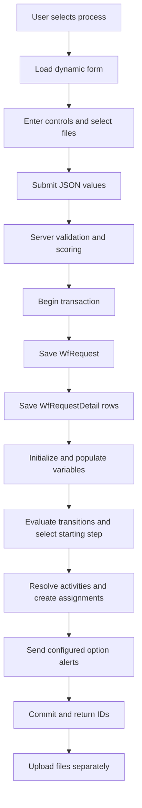
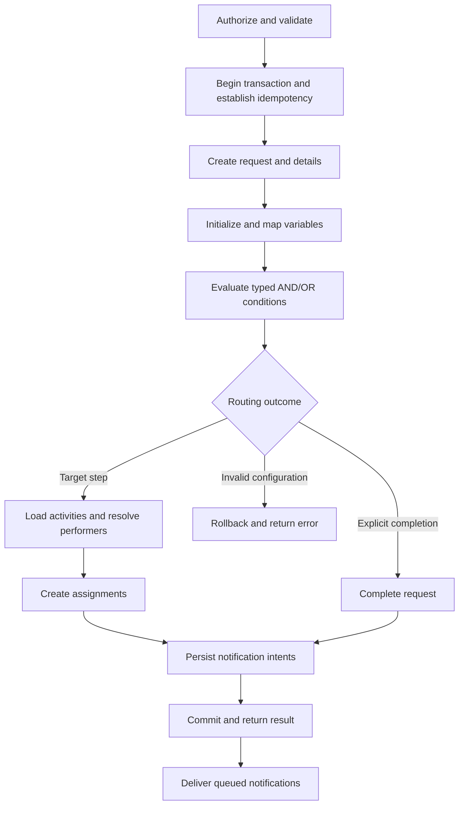

# Workflow Request Submission

Status: current behavior documentation and proposed functional design.  
Application: IAX / Workflow.  
Date: 2026-09-10.

## 1. Purpose

Define how a user submits a workflow request, how configuration should determine its execution, and how the system should display the main request and any child requests.

The submission mechanism must be generic, reusable, testable, and independent of specific license, permit, payment, or other business processes. Preserve the existing module structure and reusable infrastructure. Implement changes incrementally.

**Implementation boundary:** the current application saves dynamic requests and details, sends optional form-option alerts, and uploads attachments separately. Submission startup now maps runtime variables, evaluates persisted scalar transitions and creates starting assignments. Nested AND/OR groups, subsequent progression and child-request generation remain proposed capabilities.

See the [architecture analysis](workflow-architecture-analysis.md) for source findings, responsibilities, risks, and the current-to-proposed mapping. The [source inventory](workflow-source-inventory.md) lists Workflow source files.

See also the [Arabic deep review and enhancements](workflow-deep-review-and-enhancements.md), which records second-pass persistence findings and practical design refinements.

The [Process Configuration implementation plan](workflow-process-configuration-plan.md) maps these requirements to Process Builder settings, backend contracts, runtime dependencies, and delivery checkpoints.

### Request submission experience requirements

The following requirements define the target submission experience; they are not a statement that all capabilities are currently implemented.

- **Favorite / Frequent Requests:** Show the user's favorite and most frequently used request types for faster access.
- **Request for Entity:** Allow a request to be submitted for an employee, branch, showroom, customer, supplier, asset, project, contract, or another entity. A request does not have to be for an employee.
- **Conditional Fields:** Show or hide fields based on the user's previous answers.
- **Real-Time Validation:** Validate data as the user enters it, rather than only when the user selects Submit.
- **Save as Draft:** Allow users to save an unfinished request and return to complete it later.
- **Copy Previous Request:** Allow users to create a new request from a previous request and edit the copied data before submission.
- **Request Templates:** Allow users to save recurring data as personal templates for requests they submit regularly.
- **Parent Request:** Allow users to create a child request linked to a parent request.
- **Form Wizard:** Split large request forms into steps: Basic Information → Details → Documents → Review.

## 2. Current submission flow

### Entry points

- Frontend page: `IXApp/src/modules/workflow/pages/WfRequestFromPage.tsx`.
- Form component: `IXApp/src/modules/workflow/components/DynamicForm.tsx`.
- API adapter: `IXApp/src/modules/workflow/api/dynamicRequestFormApi.ts`.
- Backend controller: `Workflow/Requests/WfRequestController.cs`.
- Backend service: `Workflow/Requests/WfRequestService.cs`, method `SubmitDynamicAsync`.

Current endpoints:

- `GET /api/v1/WfRequest/form-definition/{processId}`: load the configured form.
- `POST /api/v1/WfRequest/submit`: validate and persist the submission.
- `POST /api/v1/WfRequest/validate-submission`: accepts the same payload as Submit and runs its shared preparation and validation without saving, generating codes, or sending alerts. Returns `{ success, errors }`; warnings do not make `success` false. Submit always repeats validation.
- `POST /api/v1/WfRequest/validate`: legacy detail-based validation implementation retained for existing consumers; its rules are not fully aligned with submission. New submission clients should use `validate-submission`.
- `GET /api/v1/WfRequest/{requestId}/mail-details`: load authorized request details and tracking history.

### What happens today

1. The user chooses a process and opens its dynamic form.
2. The application loads active controls, options, validations, and presentation metadata.
3. The user fills visible controls and selects attachments.
4. The browser validates input and sends JSON control values and option-file metadata.
5. The server rejects duplicate or unknown controls, applies read-only defaults, determines visibility, validates configured rules, and calculates score.
6. Within a database transaction, the service generates the request code and saves `WfRequest`.
7. It batches and saves `WfRequestDetail` rows, including selected-option file metadata where applicable.
8. It initializes runtime variables, maps visible control values, evaluates scalar submission transitions, resolves the starting activities and their employees, and stages variables and assignments.
9. It sends alerts for selected options configured with alert messages and static performer recipients.
10. It commits and returns the request ID, code, score, attachment-owner detail IDs, starting step and assignment IDs.
11. The browser uploads file bytes separately against the saved request/detail records. Failed uploads are reported while the request remains saved.



Submission now initializes runtime variables, maps visible control values, evaluates persisted scalar transitions and creates starting-step assignments before commit. The response includes `startingStepId` and `assignmentIds`. This confirms assignment persistence, not external notification delivery or subsequent workflow progression.

New submissions write relational details directly. Legacy XML is supported on read paths; the XML/view conversion in `IXApp/docs/request.txt` is historical reference code, not the current submission path.

## 3. Configuration and runtime records

### Workflow configuration

- `WfProcess`: process definition.
- `WfStep`: configured stage and completion policy.
- `WfActivity`: configured task, performer, SLA, and notification settings.
- `WfPerformer` / `WfPerformerUsers`: recipient-resolution configuration.
- `WfVariable` / `WfDataType`: declared variables and semantic types.
- `WfOperator` / `WfTransition`: comparison and routing configuration.
- Request/activity controls, options, validations, and variable mappings: form and data-transfer definitions.

### Runtime data

- `WfRequest`: one submitted process instance.
- `WfRequestDetail`: submitted request control values.
- `WfProcessVariable`: request-specific variable values intended for execution.
- `WfAssignment`: one runtime task assigned to an employee.
- `WfActivityDetail`: values entered while performing an activity.
- `WfProcessData`: activity completion/process data.
- Communication notification records: delivery intent, recipients, and delivery history.

`WfRequestVariable` also exists. Confirm its deployed consumers and meaning before consolidating it with `WfProcessVariable`.

## 4. Proposed generic submission pipeline

The shared execution service should perform the following operation:

1. **Authorize:** verify the actor, company, process eligibility, and permission to submit.
2. **Load configuration:** obtain an active, internally consistent process definition and its identity/version.
3. **Normalize and validate:** apply defaults, visibility, control types, options, required fields, configured rules, and attachment policy.
4. **Protect against duplicates:** establish an idempotency key for this submission.
5. **Begin the transaction:** one coordinator owns the complete database operation.
6. **Create the request:** generate its code and persist original request values.
7. **Initialize variables:** create runtime values from configured variable definitions.
8. **Apply mappings:** map normalized request controls to the correct variables.
9. **Evaluate transitions:** use typed comparisons and configured AND/OR groups.
10. **Select the next state:** determine a target step, explicit completion, or a defined no-match outcome.
11. **Resolve activities and performers:** obtain all required active tasks and eligible employees.
12. **Create assignments:** stage assignments in batches with copied runtime SLA settings.
13. **Prepare notifications:** persist delivery intents alongside workflow state.
14. **Commit:** save the operation atomically and return the execution result.
15. **Deliver notifications:** dispatch committed intents through the existing Communication channels with retry and deduplication.



Normal requests, automatic triggers, and child requests must use the same execution components. Do not maintain separate copies of submission logic.

## 5. Variables and typed evaluation

The evaluator reads an actual value from the request's runtime variables, interprets it using the variable's declared data type, and compares it with the configured transition operand using a supported operator.

```text
Submitted control
    -> configured control-variable mapping
    -> WfProcessVariable value
    -> declared WfDataType + WfOperator + expected value
    -> condition result
    -> group result
    -> transition destination
```

### Existing support and gaps

- Submission now uses `WorkflowConditionEvaluator` with semantic type/operator codes. Unsupported comparisons and malformed operands fail explicitly.
- Legacy reference code calls `ValidateValues<long>` for Integer and `ValidateValues<string>` for String.
- Legacy Boolean and DateTime branches are empty.
- The implementation of `ValidateValues<T>` was not found in the reviewed source; its exact operator behavior is unverified.
- Backend seeds define type IDs 1–4 as Integer, String, DateTime, Boolean. Process Builder now resolves supported semantic type codes instead of assuming those database IDs. Runtime execution still needs an equivalent typed evaluator.

### Proposed rules

- Integer/Decimal: equality, inequality, ordering, and inclusive Between with two operands.
- String: equality, inequality, Contains, and explicit empty/present checks with documented case handling.
- Boolean: equality/inequality using canonical true/false values.
- DateTime: comparisons and ranges using a documented UTC/offset contract; date-only values require their own explicit semantics.
- Reject unsupported types/operators, malformed operands, and invalid configuration. Do not silently treat evaluation errors as false or default to equality.
- Preserve declared types: a numeric-looking String must not automatically become a number.
- Resolve semantic type/operator codes from configuration; avoid assuming database IDs or editable labels define behavior.

## 6. Configurable AND and OR conditions

Each transition owns a condition group with a selectable evaluation mode:

- **All conditions (AND):** every condition must match.
- **Any condition (OR):** at least one condition must match.

Support nested groups when both modes are needed in one route.

Example:

```text
Target step: Senior approval

All conditions (AND)
    Amount > 10000
    Any condition (OR)
        Department = Finance
        Department = Legal
```

This represents:

```text
Amount > 10000 AND (Department = Finance OR Department = Legal)
```

Proposed storage uses `WfTransitionConditionGroup` and `WfTransitionCondition` under the existing transition. Groups define All/Any and parent grouping; conditions define variable, operator, operands, and order. AND/OR are group modes, not comparison operators in `WfOperators`.

Transition priority remains separate from grouping. The proposed first-match policy evaluates candidate transitions by `(SortOrder, RecId)` and selects the first matching route. Confirm this policy before implementation; OR does not mean execute every matching destination.

Reject empty groups, cycles, cross-process references and invalid conditions. Use an explicit fallback rule rather than interpreting an empty group as success. Save a transition and its groups atomically, and preserve grouping through designer drafts, API round trips, and import/export.

## 7. Activities, performers, and assignments

A step can contain multiple activities. Resolve performers from configuration, including:

- Request employee/applicant.
- An employee selected in a request field.
- A configured manager level.
- Explicitly configured employees.

Reuse Organization's `HcmWorkerManager` hierarchy. Distinguish employee IDs used by assignments from account user IDs used by notifications.

Each required activity must either resolve valid performers or return an explicit configuration failure. Do not leave a request silently unassigned. SQL-based performers remain unsupported until a scoped, allowlisted and parameterized resolution contract is defined.

On assignment completion, the same executor validates actor/concurrency, persists activity values and completion data, updates variables, applies activity/step completion policy, evaluates the next route, and creates subsequent assignments or completes the request.

`WfStep.MustCompleteAll` and multiple-recipient completion rules must be defined independently of transition AND/OR conditions. The current auto-pass job must eventually call the shared completion operation rather than only setting assignment finish flags.

## 8. Child requests using different processes

A main request may generate one or more child requests. Each child may use a different process and has its own form, variables, steps, assignments, notifications, and history.

```text
Main request: License process
    Child request: Inspection process
    Child request: Payment process
```

The main request retains its process. A child receives the configured target process and executes through the same workflow engine.

### Required configuration

- Source activity and invocation trigger.
- Target process.
- Explicit parent-value to child-control input mappings.
- Requester/employee policy and initiating actor audit.
- Continue independently or wait for child completion.
- For several children: wait for all required children or any successful child, with an explicit policy for remaining children.
- Failure, retry, cancellation, and optional child-output to parent-variable mappings.

Use a runtime relationship such as `WfRequestLink` to record parent, child, source execution occurrence, configuration identity, invocation key, and dependency state. Enforce idempotent creation: retries must not generate duplicate children. Multiple legitimate children may use the same process.

Default to the same company. A different process must not bypass target-process eligibility, request access, or attachment permissions. Bound nesting and detect unsafe recursive invocation configurations.

Child completion resumes a waiting parent exactly once through normal engine progression. Do not rely solely on an in-memory notification event. Parent cancellation must have an explicit child policy; retain historical records.

## 9. Main and child requests on one page

The unified request page should show the main request and expandable child sections together. Users should not need another page to inspect a child's details.

```text
Main request header: code, process, requester, status, dates
    Original details and attachments
    Completed stages
    Pending assignments

    Child request: Inspection
        Status and whether it blocks the main request
        Original details and attachments
        Completed/pending stages and performers

    Child request: Payment
        Status and whether it blocks the main request
        Original details and attachments
        Completed/pending stages and performers
```

Allow multiple expanded children, show nested children under their parent, and load detailed content on demand. Each stage should expose performer, assignment date, completion date, outcome, controls, and documents. Preserve all parallel pending assignments.

Reuse common request-detail/history/attachment components for every process. Every action must identify the request/assignment it affects. Enforce permissions per child; access to the main request alone does not grant child access. A combined timeline may be offered, with request/process identity attached to every event.

## 10. Transactions, attachments, and notifications

- One coordinator owns the database transaction. Helpers stage changes; they must not independently commit a parent operation.
- Batch detail, variable, and assignment writes. Keep necessary saves for generated IDs; avoid saves per control or recipient where practical.
- Persist request state and notification intents together, then dispatch externally after commit. The current synchronous alert delivery inside submission is a reliability concern.
- Use idempotency keys and concurrency checks for submission, child creation, assignment completion, and background triggers.
- Enforce configured uniqueness with a database-backed mechanism under a documented company/control scope; a read-before-write check alone is insufficient.
- Actual attachment uploads currently happen after request commit. Before making mandatory files a prerequisite for workflow activation, define staging/finalization and recovery behavior. Metadata alone does not prove files were uploaded.
- Failed delivery must be distinguishable from failed submission. Queued notification intent is not delivered email/SMS.

## 11. Execution result and errors

Preserve the existing public result fields: request ID, code, score, and attachment owners. Extend the result compatibly when runtime execution is introduced to expose status, selected/current step or assignments, and notification-queue state where useful.

Return structured validation errors with control/condition identifiers and stable error codes. Distinguish input errors, eligibility failures, invalid configuration, concurrency conflicts, and unexpected failures. Log request/process/assignment and correlation IDs without routinely logging complete submitted values.

Do not report a request as assigned when no assignments were created, a child as created before its relationship is committed, or a notification as delivered merely because it was queued.

## 12. Implementation order

### Submission foundation review — 2026-09-10

The initial checkpoint covered submission foundation and validation. The subsequent startup checkpoint connects scalar routing and starting assignments; complete workflow progression remains pending.

| Area | Source finding and implementation status |
| --- | --- |
| Normalization | Fixed: omitted editable defaults previously bypassed the uniqueness value lookup and could differ from visibility inputs. `DynamicRequestValues.Normalize` now supplies every configured control before preparation. Explicit empty answers still clear editable defaults. |
| Authoritative preparation | Extracted `PrepareSubmissionAsync` inside `WfRequestService`. Submit and `validate-submission` use the same form loading, control ownership checks, visibility, rules, option-file metadata and uniqueness checks. |
| Validation-only API | Added a read-only operation using the Submit payload and a typed frontend adapter. The form continues to submit directly; no additional validation network round trip is required. Legacy `/validate` behavior is retained. |
| Persistence | Existing request/detail transaction, scoring and attachment-owner response are preserved. File bytes still upload after request commit. |
| Regression evidence | Five normalization cases cover omitted defaults, explicit null/empty answers, trimming submitted answers and read-only overrides. These are unit tests, not database uniqueness or authenticated endpoint tests. |
| Remaining validation work | Legacy endpoint migration, unsupported-rule handling, and complete browser/server rule parity require further characterization. |
| Remaining reliability work | Database-backed uniqueness, submission idempotency and durable notification intents remain required. Current uniqueness uses a read-before-write query; notifications still run inside the submission transaction. |

Next foundation checkpoints are database-backed submission tests (including rollback and omitted-default uniqueness), legacy validation contract migration, then atomic idempotency and durable notifications. Do not describe the foundation or the full workflow engine as complete until those gates pass.

1. Characterize current submission, details, scoring, visibility, attachments and legacy reads.
2. Align type/operator contracts and unify authoritative server validation.
3. Extract focused form, query, and execution responsibilities while preserving existing API behavior.
4. Establish transaction ownership, idempotency, eligibility and durable notification intents.
5. Add typed variable mapping and AND/OR evaluation with atomic configuration storage.
6. Connect step selection, performer resolution and assignment creation.
7. Add completion/progression and route auto-pass through the same engine.
8. Add configured child invocation, dependency policies and parent-child history.
9. Compose the unified main/child page from shared request components.

Enabling workflow routing is new functionality in this checkout, not only a behavior-preserving refactor.

## 13. Acceptance criteria

- A valid request persists its details and starts the configured workflow atomically under the agreed attachment policy.
- Invalid submissions leave no partial runtime state or externally delivered pre-commit alerts.
- AND, OR, nested groups and route ordering produce deterministic results using declared data types.
- Unsupported comparisons and missing required performers return clear errors.
- Duplicate submission/completion/child triggers do not create duplicate runtime effects.
- Assignments respect company, actor, performer and completion policies.
- Child requests can run different processes, receive mapped inputs and report completion under configured wait policies.
- Main and child details, stages and authorized attachments appear on the same page with accurate independent statuses.
- Existing form, localization, legacy history and shared UI behavior remain compatible.

## 14. Decisions required before enabling execution

Confirm no-match/default routing, explicit terminal-state representation, first-match versus fan-out behavior, multiple-recipient completion, mandatory-file activation rules, missing-manager behavior, definition snapshot/version policy, child outcome/wait/cancellation policies, and eligibility for automatic submissions.

These decisions should be configuration or documented engine policies. Do not introduce process IDs, form labels, or business-specific conditions into the generic executor.

## 15. Refinements from the deeper review

- Submission now produces one normalized value set for visibility, validation, uniqueness, scoring and persistence. Omitted editable answers use configured defaults; explicitly empty answers remain empty; read-only answers always use configuration. Runtime variable mapping remains pending. Normalization regression tests cover omitted defaults, explicit empty/null answers and read-only overrides; database concurrency enforcement remains pending.
- For mandatory files, consider a prepared request followed by an idempotent activation operation after authorized uploads are verified. Keep ordinary submissions seamless when no staged files are required.
- Distinguish execution state, business outcome, and waiting reason; completed child work is not necessarily successful business approval.
- Associate assignments and child invocations with the specific stage execution occurrence, so retries and late results cannot advance another occurrence.
- Validate and version complete workflow definitions before publication; provide a read-only condition/routing preview using the actual evaluator.
- Establish trusted company/actor context for background commands; existing HTTP-derived context is insufficient as an implicit multi-company job contract.
- Verify EF mappings before relying on ordering or concurrency. Runtime variables ignore `RowVersion`/`SortOrder`; mapping orders are also ignored in the relevant current configurations.
- Preserve the legacy completion-data relationship: `WfActivityDetail.ProcessId` maps to `TaskID` and is used for a `WfProcessData` identity in seeding. `WfProcessData.ActivityDetails` remains XML-typed.
- Define explicit child input/output ownership and conflict handling; do not synchronize all parent/child variables automatically.
- Add operational recovery for a failed command or delivery rather than restarting an entire request and repeating its effects.

These are proposed requirements and verified source caveats, not completed implementation. Detailed evidence, priorities and failure scenarios are in the linked deep review.

## 16. Extended workflow business requirements

The following requirements extend the target submission and workflow experience. They do not imply that these capabilities are fully implemented. They complement the submission experience requirements in section 1 and the execution design above.

### Approvals and request lifecycle

- **Parallel Approval:** Send a request to multiple approvers at the same time, with configurable completion rules such as unanimous approval, majority approval, or approval by any one approver.
- **Conditional Approval:** Automatically vary the number and level of approvals based on amount, branch, department, request type, or other request data.
- **Delegation:** Allow a manager to delegate approval authority to another person for a defined period of leave or absence.
- **Substitute Approver:** Automatically route the task to a designated substitute when the responsible approver is unavailable.
- **Escalation:** Send a reminder when a task is not handled within the allowed time, then escalate it to the next management level according to the configured policy.
- **Return for Correction / Rework:** Return a request to its requester to correct specified data, then resume at the same workflow point instead of restarting the process.
- **Request More Information:** Allow an approver to request additional information or attachments without rejecting the request.
- **Withdraw Request:** Allow the requester to withdraw a request until it reaches a stage that prevents withdrawal.
- **Cancel / Suspend / Resume:** Allow authorized users to cancel a request, or suspend it and resume it later, according to permissions and business policy.
- **Reopen Completed Request:** Allow a completed request to be reopened in defined business circumstances, with the reason recorded.

### Business rules, approvers, and decisions

- **Dynamic Business Rules:** Allow administrators to configure rules such as `Amount > 50,000 AND Branch = Riyadh → CFO Approval` without requiring a system change for each case.
- **Rule Groups (AND/OR):** Support compound conditions using AND/OR groups rather than only a single condition.
- **Approval Matrix:** Define a central approval matrix based on amount, department, job position, region, expense type, or other business criteria.
- **Dynamic Performer Resolution:** Select the responsible person using the organizational hierarchy, branch, department, job position, request data, or business rules.
- **Role-Based Approval:** Assign approval to a role such as Finance Manager rather than binding the process to a named employee.
- **Multi-Level Management:** Support configurable management chains such as Manager → Manager's Manager → Department Head → General Manager.
- **Dynamic Decisions:** Allow each process to define its own decisions beyond Approve and Reject.
- **Decision Requirements:** Define requirements for each decision, such as a mandatory rejection reason or an attachment for approval above a specified amount.

### SLA and working time

- **SLA Management:** Define the allowed completion time for each stage and task.
- **Business Calendar:** Calculate SLA deadlines using working days and hours, excluding Friday/Saturday and public holidays where required by company policy.
- **Automatic Reminders:** Notify the responsible person before and after the SLA deadline.

### Process versions and reuse

- **Process Versioning:** Keep existing requests on the workflow version under which they started, while new requests use the newly published version.
- **Draft → Publish:** Allow workflow administrators to design and test a draft process before publishing it, instead of making every edit immediately active.
- **Effective Dates:** Define the start and end dates during which a process or version is valid.
- **Workflow Templates:** Provide reusable templates such as Approval Workflow, Financial Approval, and Employee Request.
- **Reusable Sub-Processes:** Reuse common procedures such as Finance Approval across multiple processes instead of redesigning them each time.
- **Parent/Child Requests:** Allow a parent request to create child requests and track their completion, following the relationship and dependency policies described above.

### Automation and triggers

- **Automatic Actions:** Execute configured business actions after final approval, such as updating a status, creating a document, or sending data to another system.
- **Event-Based Triggers:** Start a workflow automatically when an event occurs, in addition to requests created manually by users.
- **Scheduled Triggers:** Start a process at a configured time, such as 30 or 60 days before a contract or license expires.
- **Recurring Processes:** Automatically create requests on a daily, weekly, monthly, or yearly schedule.

### Dynamic forms and signatures

- **Dynamic Forms Rules:** Show or hide fields based on previous answers, make fields conditionally required, and change available options based on another field.
- **Calculated Fields:** Automatically calculate values such as Total, VAT, Score, or Duration.
- **Cross-Field Validation:** Validate relationships between fields, such as requiring the end date to be after the start date.
- **Dynamic Reference Data:** Populate selection lists from employees, branches, suppliers, customers, departments, and other reference data.
- **Form Sections & Steps:** Divide large forms into sections or wizard steps.
- **Digital Signature:** Support signatures where the process requires formal sign-off.

### Collaboration and history

- **Comments & Discussions:** Support discussions within the request among participants, retaining a complete conversation history.
- **Mentions:** Allow participants to mention a user, such as `@Employee`, in comments.
- **Complete Timeline:** Visually show the request journey from creation to its current stage.
- **Audit Trail:** Record every change, decision, and transition, including who performed it and when.

### Monitoring, reporting, and documents

- **Process Monitoring:** Provide a dashboard showing where requests accumulate and which stages cause delays.
- **Bottleneck Analysis:** Identify the stages that consume the most time.
- **SLA Performance:** Show the percentage of requests completed within the allowed time.
- **Approver Performance:** Show each approver's average task handling time, subject to permissions and organizational policy.
- **Dynamic Reporting:** Allow business administrators to build reports using fields, filters, grouping, and measures without requesting a new report from a developer.
- **Process-Specific KPIs:** Allow each process to define its own performance indicators.
- **Saved Reports / Views:** Allow users to save and reuse reports, filters, and views.
- **Scheduled Reports:** Send periodic reports to management.
- **Print Template Designer:** Allow a print layout to be designed for each process without developing a separate report.
- **Document Generation:** Generate a PDF or official document from request data after the process completes.

### Design and testing tools

- **Process Designer:** Provide a visual interface for building flows such as Start → Step → Decision → Approval → End.
- **Rule Designer:** Provide a business-user interface for creating conditions without code.
- **Form Designer:** Support drag-and-drop design of dynamic forms.
- **Simulation / Test Mode:** Allow a process to be tested before publication and show the route a sample request would follow.
- **Process Clone:** Allow a new process to be created by copying an existing process.
- **Import/Export Process:** Support transferring process definitions between development, test, and production environments.

### Organizational scope and governance

- **Multi-Company / Multi-Branch:** Support multiple companies and branches on the same platform, with different rules and approvers where required.
- **Process Ownership:** Assign a business owner responsible for each process.
- **Governance & Change Approval:** Allow sensitive workflow changes to require approval before publication.

### Future AI assistance

- **AI Assistance:** Help approvers summarize long requests and attachments, identify missing information, suggest routing, search requests, and explain why a request followed a particular route. Official decisions and approval rules must remain under the control of business rules.

## 17. Submission startup implementation

The submission transaction now executes: Create Request → Create Request Details → Create Variables → Populate Variables → Determine Step → Create Assignments → Commit.

- Request detail rows retain normalized submitted values, ControlLabel, ControlLabelAlias, control identities, order and scores. Labels are copied at submission and preferred on read; older rows with empty labels fall back to the current control definition. This does not freeze the complete form definition.
- One WfProcessVariable is created per active process variable. Unmapped and hidden-control variables remain empty. Active cross-process mappings and multiple request mappings into one variable are rejected.
- Only active transitions without an activity trigger participate at submission. Request-control triggers must belong to the process and be visible. Browser-only AND/OR drafts are not executed.
- Routing selects the first match ordered by SortOrder then RecId. No match, an unavailable destination, or an empty starting step fails submission. There is no implicit first-step fallback or fan-out.
- Strings use ordinal case-insensitive equality and Contains without numeric coercion. Integer values must be integral; Boolean values are canonical true/false. Date-only values mean midnight UTC; timestamps require explicit offsets. Between uses a JSON array of two string operands, inclusive.
- Performer resolution supports relational/request employees, a visible related employee control, one configured manager level through Organization, and explicit employee memberships. SQL resolution and unknown performer types fail explicitly. Each activity must resolve active employees. Multiple employees create one assignment per employee without duplicates within that activity.
- Assignments copy activity, step, employee, UTC assignment time, score and auto-pass settings. Failure before commit rolls back request, details, variables and assignments through the existing transaction coordinator.
- File bytes still upload after commit. Metadata validation does not prove upload completion. Existing option alerts retain their existing transaction behavior; assignment notification delivery is not added here.
- Existing tables support this implementation without a migration. Assignment completion, approval aggregation, idempotency, durable notifications and immutable definition snapshots remain separate work.

Evaluator tests and compilation do not establish authenticated live submission. Database rollback, complete performer resolution and live assignment creation still require integration verification.
