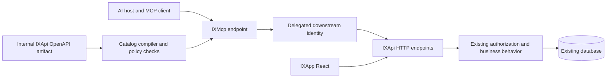

# IXMcp: project analysis and implementation plan

Date: 2026-09-16  
Status: architecture plan; C1 offline discovery and proposed metadata contract implemented on 2026-09-17. Later checkpoints remain pending.
Planned location: `C:\Users\Omar.Qaid\Desktop\IAX\IXMcp`.  
Revision: 3, incorporating the seven-gap review and the subsequent consistency and execution review.  
Authorization: the user requested implementation on 2026-09-17; work begins with the bounded C0/C1 discovery checkpoint. Deployment and writes are not enabled.

Current checkpoint: [C0/C1 discovery implementation and evidence](IXApi/docs/mcp-checkpoint-c1.md): 917 generated operations, including 200 Workflow operations, three disabled pilot candidates, and 30 passing focused tests. [Metadata contract v1](IXApi/docs/mcp-metadata-contract.md) defines their proposed identities and field/query restrictions. First client confirmed: **assistant inside IXApp**. The chat UI requires server-side model orchestration acting as an MCP client; provider and delegation choices remain open. The discovery checkpoint does not implement that UI or orchestration.

## 1. Objective and exact automation promise

Build a standalone C# MCP server that reads IXApi OpenAPI, generates typed tools, and executes them through existing HTTP endpoints. It supports all six modules through one reusable adapter engine. IXApi remains responsible for business rules, permissions, company access, transactions, and persistence.

The maintenance target is **no handwritten MCP tool or copied DTO for each ordinary endpoint**. When a developer adds an eligible endpoint or changes a referenced DTO, the catalog updates after the API document is regenerated and the server refreshes it. Source-code edits alone do not change a running API or catalog.

Automatic generation and automatic admission are separate:

| Change | Intended behavior |
|---|---|
| New supported read operation inside an approved exposure profile | Generate and publish automatically after schema and policy checks |
| DTO property added or changed | Regenerate affected input/output definitions; classify compatibility |
| Unreferenced DTO added | No tool; DTOs are schemas, not operations |
| New module | Discovered by the inventory; requires a module exposure profile before publication |
| New write operation | Generate a candidate; publish only when its write policy is satisfied |
| Removed operation | Remove from the next catalog; reject stale calls without redirecting them |
| Unsupported media type or serialization | Quarantine with an explicit diagnostic; never silently guess |
| New permission or business approval requirement | Owned by IXApi/policy metadata; not inferred from DTOs |

An unrestricted promise that every endpoint becomes immediately executable would expose account administration, notification sending, background jobs, and broad exports. The proposed production contract automates supported operations within reviewed policies. Extending supported OpenAPI features remains normal platform maintenance.

## 2. Scope and evidence limits

Reviewed current source: host registration, OpenAPI setup, JWT validation, permission filters, company middleware, EF query filters, shared CRUD/query contracts, and representative operations in all modules. No applications were started, databases queried, packages installed, or live OpenAPI documents fetched. No builds or tests were run for this planning task.

Counted 89 files matching `*Controller.cs` under `IXApi/src/Modules`:

| Module | Controller files | MCP treatment |
|---|---:|---|
| Administration | 9 | Restrict audit/job reads; separately admit job execution and configuration |
| Communication | 4 | Start with caller-owned notification reads; separately admit outbound communication |
| Finance | 35 | Start with bounded lookups; validate each transaction type before writes |
| Identity | 4 | Use identity context internally; keep credential/role/permission mutation out of general catalogs |
| Organization | 12 | Start with low-sensitivity lookups; classify personnel and document fields |
| Workflow | 25 | Preserve form, participant, request, and runtime rules |

These are controller-file counts, not route counts or a security certification. Inherited actions, route aliases, `[NonAction]`, and API Explorer behavior require a generated-document census in checkpoint C1. The capability matrix below is a representative verified source inventory, not a claim that every endpoint has been audited.

## 3. Current architecture findings

| Finding | Source | Design consequence |
|---|---|---|
| IXApi targets .NET 9 and references six module assemblies | [IXApi.csproj](IXApi/IXApi.csproj) | IXMcp can be independent and communicate over HTTP |
| OpenAPI is registered with a bearer security scheme | [ServiceCollectionExtensions.cs](IXApi/Bootstrap/Extensions/ServiceCollectionExtensions.cs) | Reuse generation, then enrich operation metadata centrally |
| `MapOpenApi()` is conditional on `ApiDocumentation:Enabled` and allows anonymous access when mapped | [Program.cs](IXApi/Program.cs) | Do not enable public documentation merely to feed MCP; provide an internal document or build artifact |
| Existing OpenAPI customization reviewed here adds security metadata, not MCP exposure rules or stable tool IDs | [ServiceCollectionExtensions.cs](IXApi/Bootstrap/Extensions/ServiceCollectionExtensions.cs) | Add centralized conventions; verify actual generated operation IDs in C1 |
| JWT validation uses configured issuer, audience, symmetric signing key, lifetime, and token blacklist | [AppSettingsExtensions.cs](IXApi/Bootstrap/Extensions/AppSettingsExtensions.cs) | Existing login is not a ready-made remote MCP OAuth/delegation solution |
| Permission checks include MVC filters with HTTP-method inference | [DomainPermissionAttribute.cs](IXApi/src/Modules/Identity/Permissions/DomainPermissionAttribute.cs) | HTTP forwarding preserves execution; catalog policy must use the original operation's semantics |
| A second authorization mechanism uses named permission policies | [RequirePermissionAttribute.cs](IXApi/src/Modules/Identity/Permissions/RequirePermissionAttribute.cs) | Inventory both mechanisms and effective class/action metadata |
| Company middleware validates caller-selected headers | [CompanySelectionMiddleware.cs](IXApi/Api/Middleware/CompanySelectionMiddleware.cs) | Inject validated company per call; retain downstream validation |
| EF company filtering has explicit shared-table exceptions | [ApplicationDbContext.cs](IXApi/src/Infrastructure/Persistence/ApplicationDbContext.cs) | Company headers alone do not prove every returned field is isolated; review joins and shared records |
| Shared CRUD contains hooks, numbering, transactions, and mapping | [BaseController.cs](IXApi/src/Shared/Application/Controllers/BaseController.cs) | Forward HTTP; do not recreate these behaviors in IXMcp |
| Customer has multiple route aliases and an unpaged list operation | [CustomerController.cs](IXApi/src/Modules/Finance/AccountsReceivable/Customer/Controllers/CustomerController.cs) | Choose one canonical route; prefer verified paged contracts |
| Sales quick-create applies defaults and numbering in the controller | [SalesTableController.cs](IXApi/src/Modules/Finance/AccountsReceivable/SalesOrder/Controllers/SalesTableController.cs) | Existing controller remains the transaction entry point |
| Workflow disables inherited generic create, paging, and bulk actions | [WfRequestController.cs](IXApi/src/Modules/Workflow/Requests/WfRequestController.cs) | Only published operations are eligible; never synthesize missing CRUD |
| Workflow ownership checks permit creators, relevant employees, and assignments; broad viewing uses permission checks | [WfRequestService.Authorization.cs](IXApi/src/Modules/Workflow/Requests/WfRequestService.Authorization.cs) | Do not require a broad view permission just to expose a caller-owned request tool |
| Query DTO supports nested filters and includes; page size is capped at 100 | [PaginationParamsDto.cs](IXApi/src/Shared/Application/Contracts/PaginationParamsDto.cs) | Complex query binding needs proof; unrestricted includes should not be exposed |
| `/api/v1/Auth/me` returns permissions and company context | [AuthController.cs](IXApi/src/Modules/Identity/Authentication/AuthController.cs) | Useful internal context source after downstream authentication is established |

The similarly named `QueryFilterDto.cs` contains commented-out definitions; `PaginationParamsDto.cs` is the active contract. Do not generate adapters from filenames or raw source heuristics.

No general HTTP idempotency-key or ETag handling was found in the reviewed API/module/shared searches. Entity row-version properties exist, but do not establish a working optimistic-concurrency contract for every endpoint. Verify writes individually.

## 4. Technology and architectural decision

Use C#, ASP.NET Core, the official MCP C# SDK, an OpenAPI parser, a compatible JSON Schema validator, and `IHttpClientFactory`. Pin released dependencies and prove their compatibility in C0/C3. Do not depend on examples from an unpinned SDK main branch as a production API contract.

For a new independent server, prefer **.NET 10 LTS**, subject to deployment availability. IXApi can remain on .NET 9 during this work because the interface is HTTP. Microsoft lists .NET 9 support ending November 10, 2026, and .NET 10 support ending November 14, 2028. Keep the eventual IXApi upgrade as a separate change. [Microsoft support policy](https://dotnet.microsoft.com/en-us/platform/support/policy/dotnet-core).

The official SDK provides an ASP.NET Core package for HTTP servers. Use Streamable HTTP for remote clients; optional stdio can be added for a selected local client. Select the protocol revision and released SDK together with the target client's capabilities. [Official SDK](https://github.com/modelcontextprotocol/csharp-sdk), [transport documentation](https://github.com/modelcontextprotocol/csharp-sdk/blob/main/docs/concepts/transports/transports.md).



IXMcp contains no business EF Core model, direct business-database access, references to IXApi business assemblies, LLM orchestration loop, or handwritten module services. Dedicated credential or approval infrastructure storage may be introduced by the relevant checkpoint. It needs no model API key to expose tools. The AI host owns model selection and tool selection.

## 5. Proposed project layout and ownership

```text
IAX/
  IXApi/                         Existing REST application
  IXApp/                         Existing React application
  IXMcp-Implementation-Plan.md    This document
  IXMcp/
    IXMcp.csproj
    Program.cs
    global.json                  Independent SDK pin
    appsettings.json             Non-secret defaults only
    OpenApi/                     Load, parse, normalize, resolve references
    Catalog/                     Compile, version, filter, and refresh tools
    Tools/                       MCP discovery/call integration
    Execution/                   HTTP binding, dispatch, result mapping
    Security/                    Identity, exposure, company, approval checks
    Configuration/               Typed options and startup validation
    Observability/               Audit events, metrics, health
    docs/                        Setup, client connection, operations runbook
  IXMcp.Tests/                   Unit and integration tests
    global.json                  Same approved SDK selection as IXMcp
```

Folders describe responsibilities, not a requirement for one interface per class. Add only what a checkpoint needs. A root solution can group projects later; IXMcp builds independently and does not need to join the IXApi solution.

SDK selection is sensitive to invocation location: a `global.json` inside IXMcp does not establish the SDK for commands started in its sibling test directory. Keep the server/test SDK pins aligned with a CI check and run documented commands from their designated directories. Any later root solution must have an explicit SDK strategy without accidentally changing IXApi's existing SDK selection. C2 verifies the selected SDK and build/test behavior in both directories. [Microsoft SDK selection rules](https://learn.microsoft.com/en-us/dotnet/core/tools/global-json).

| Owner | Responsibility |
|---|---|
| IXApi | Accurate OpenAPI, exposure metadata, authorization, business validation, company/record scope, persistent write guarantees |
| IXMcp | Generic schema translation, catalog generation, safe HTTP execution, transport authentication, policy enforcement, observability |
| Identity platform | OAuth login, consent, token issuance/delegation, subject mapping, revocation |
| AI client | User interaction and tool selection; confirmation UI where supported |
| Deployment/CI | Validated schema artifact, dependency versions, compatibility gates, secret management and rollout |

## 6. OpenAPI publication and metadata contract

Create a dedicated internal MCP OpenAPI document or generated artifact in IXApi. Use centralized document/operation/schema transformers so ordinary modules inherit conventions. ASP.NET Core supports those transformer categories. [Microsoft OpenAPI customization](https://learn.microsoft.com/en-us/aspnet/core/fundamentals/openapi/customize-openapi?view=aspnetcore-9.0).

Recommended production source: a versioned schema artifact produced from the same IXApi release. Development may fetch a configured internal OpenAPI URL. A future protected `/openapi/mcp.json` route is a proposal, not an existing endpoint. A build-time generator must not run database initialization or start production background jobs as a side effect; use an isolated generation configuration and test this explicitly.

Proposed application extensions:

| Extension | Meaning |
|---|---|
| `x-ix-module` | Stable owning module |
| `x-ix-mcp-exposure` | Disabled, approved read, or explicitly reviewed write |
| `x-ix-canonical-operation` | Stable logical operation identity used to deduplicate route aliases |
| `x-ix-authorization` | Effective policy description, including record-scoped/unknown cases |
| `x-ix-company-scope` | Company-required, user-scoped, or shared; never inferred solely from a DTO field |
| `x-ix-side-effects` | Read, create, update, delete, send, execute, or unknown |
| `x-ix-approval-policy` | Policy identifier for consequential operations |
| `x-ix-query-policy` | Allowed filter/sort/include fields and paging restrictions |
| `x-ix-data-policy` | Allowed output fields, sensitivity and size class |

These names are proposed IAX conventions, not built-in MCP/OpenAPI features. Standardize them once; do not maintain duplicate route maps in IXMcp.

Metadata extraction must inspect effective MVC action/controller metadata. `DomainPermissionAttribute` currently stores its arguments privately; a read-only metadata contract or central metadata reader will need a narrow IXApi change. Do not parse source text at runtime. Preserve actual combination/override behavior with tests, especially class-level View plus action-level Create/Edit.

Generation must honor `[NonAction]`, API version, anonymous routes, deprecated endpoints and route aliases. Standard module defaults can admit ordinary reads; sensitive reads and writes require more specific policy. Unknown policy defaults to excluded with a report.

### Exposure-policy precedence

Central defaults supply missing classifications; operation metadata refines them, but cannot override an explicit deployment exclusion or emergency deny. Execution requires the intersection of supported contract, admitted operation, deployment profile, caller scope and current IXApi authorization. Missing or contradictory security metadata prevents admission and produces a diagnostic. Configured field/query limits may narrow the documented contract; they may not grant access that IXApi denies.

Only controlled deployment configuration can select or broaden a profile. Tool arguments and arbitrary client headers cannot select a more privileged catalog. Recheck current exclusion rules during calls, even when the caller knows a tool name that was previously listed. C1/C3/C5 test conflicting metadata, explicit deny versus module defaults, profile tampering, and a cached tool call after access is withdrawn. This precedence is adapter exposure policy; it does not change MVC authorization semantics.

## 7. Tool identity, schemas, and HTTP mapping

Use a stable, unique OpenAPI `operationId` as the logical tool identity. Establish a convention such as `finance_customers_search`; names here are proposed. Inherited operations need owning-controller identity. Initially generated IDs may use module/controller/action, but once published they become compatibility contracts; renames require an explicit retained ID or versioned replacement. Do not silently resolve collisions with arbitrary suffixes.

Select one canonical Customer route, preferably the current versioned route chosen in C1; hide its aliases from the catalog. Do not deduplicate by matching path strings alone.

Proposed input shape:

```json
{
  "context": { "company": "dat" },
  "path": { "requestId": 123 },
  "query": {},
  "body": {}
}
```

Generate only relevant sections. `context` is reserved adapter context, not forwarded as request JSON. Path/query/body sections prevent property-name collisions. The configured binding plan constructs requests deterministically; a model never chooses URL, method, credentials or arbitrary headers.

Schema work must cover:

- OpenAPI version detection and supported JSON Schema dialect conversion; do not copy OpenAPI 3.0 schemas unchanged and assume equivalence.
- Local references, nested objects, arrays, nullable/required distinction, enums, formats, constraints and defaults. Bound recursion and document size; reject untrusted remote references.
- Separate input and output semantics for read-only/write-only fields and additional properties. Preserve intentional dictionary fields.
- Path escaping, query style/explode, repeated arrays, invariant culture, omitted versus explicit null, JSON request bodies and media types.
- ASP.NET nested filter binding: prove the actual `Filters[0].Field`/array representation against IXApi. If generated OpenAPI is insufficient, enrich it with one reusable binding convention, or exclude complex filters until supported.
- `allOf`/`oneOf`/`anyOf` and discriminators: validate supported combinations; quarantine unsupported cases rather than discard constraints.
- Int64 identifiers and monetary precision across clients. Test beyond JavaScript's safe integer range; use an explicit lossless representation policy with validated conversion where necessary, never implicit rounding.
- Actual serialized property casing and enum representation from the API contract, not guessed C# names.

The first supported execution profile is JSON responses and simple path/query inputs plus JSON bodies for later writes. Multipart, file downloads, streaming responses, arbitrary cookies, callbacks and webhooks are excluded initially. Each unsupported operation must be visible in the inventory report with a reason. OpenAPI defines parameter serialization and media contracts that this adapter must respect. [OpenAPI 3.0.3 specification](https://spec.openapis.org/oas/v3.0.3.html).

Workflow control definitions are runtime data: changing a configured process will not necessarily change OpenAPI. The agent first reads `form-definition`, builds the values required by that process, and uses the existing validation/submission operations. Do not generate one static tool per configured process or claim OpenAPI encodes every dynamic rule.

## 8. Catalog generation, scale, and refresh

Pipeline: load trusted document -> validate -> normalize aliases and schemas -> apply exposure policy -> compile immutable binding plans -> compare catalog versions -> atomically activate.

Each snapshot records source release/hash, policy version, compiler version, supported protocol profile, accepted operations and exclusions. Avoid a partially updated catalog. Each call uses one immutable snapshot and is checked against current emergency deny rules before dispatch.

Development refresh can use a configurable poll (initial proposal: 60 seconds) with ETag/hash comparison. Production promotes the API and schema together and checks the deployed release identity. Compatible additions update automatically; breaking changes are gated by CI or published as a new contract version.

### Client contract compatibility

A server snapshot identifies the schema used to execute a call; it does not identify the schema a client previously saw. Keep a published tool name bound to compatible input, output, policy and business semantics. Required-input additions, type changes, removals, changed units, or changed side effects trigger explicit compatibility review. Even an optional property is not automatically compatible if it changes defaults or data exposure.

Publish incompatible operations under a new versioned tool name. Retain the old name only while its original backend contract remains supported; otherwise return an unavailable/retired-tool error. Never redirect an old name to an incompatible handler. Catalog hashes assist diagnosis but are not proof that a client understood the latest contract. Approval-bound writes also reject a changed catalog/payload binding and require a new review.

C7 acceptance: retain a client connected to the previous catalog during promotion. Its old calls must execute the original compatible behavior or fail explicitly, never execute a new meaning. Repeat after rollback and emergency retirement.

### Mixed-version API deployments

Produce a trusted release manifest alongside the schema with API release identity, schema digest, policy version, supported tool contract versions and minimum compatible adapter version. The manifest format and deployment identity check are C1 deliverables; neither is assumed to exist today. Retrieve both artifacts from controlled deployment storage and verify their association and integrity.

For a rolling deployment, keep the active catalog within the intersection of contracts supported by all API instances receiving its traffic. Deploy backward-compatible API instances first, verify the routed pool, then activate the new catalog. If that intersection cannot support a change, route the new contract to an explicitly selected compatible deployment or use a coordinated maintenance cutover. Do not rely on a load balancer randomly choosing a compatible instance.

C7/C9 acceptance: run old and new API versions behind the staging routing arrangement, exercise catalog promotion and rollback, and prove that incompatible operations never reach an unsupported instance. An incompatible manifest prevents activation and marks readiness/dependency status appropriately.

An invalid refresh keeps the previous compatible snapshot temporarily and marks health degraded. A configured maximum age bounds this fallback; known removed/revoked operations are disabled immediately, and writes stop on a known API/catalog mismatch. A process with no valid catalog is not ready.

Use paged MCP discovery and module profiles to control catalog size. A client need not receive every module's tools. Do not replace typed tools with an opaque universal execute function merely to reduce tool count. Optional searchable discovery can follow after client support is demonstrated.

Notify clients of list changes when supported by the selected protocol/transport. Document reconnect or explicit refresh for clients that cache tools. The acceptance promise is server-side catalog refresh plus verified client behavior, not instant refresh in every AI product. [MCP tools specification](https://modelcontextprotocol.io/specification/2025-11-25/server/tools).

## 9. Authentication and downstream delegation

This is the principal deployment decision. IXApi currently accepts its own JWTs; adding MCP does not make its login controller an OAuth authorization server.

For remote multi-user deployment:

1. Select the target client and an established OAuth/OIDC provider compatible with its MCP flow.
2. Register IXMcp as a protected resource and advertise the required authorization/resource metadata.
3. Validate incoming token signature, issuer, MCP audience, lifetime and scopes; support revocation according to the selected provider.
4. Obtain a separate IXApi-audience token through a supported delegation/token-exchange design.
5. Map the provider subject to the existing IAX user deterministically; preserve the correct user, company and permission context.
6. IXApi validates that downstream credential and executes its normal permission checks.

The exact issuer integration remains a C0 decision: either extend IXApi to trust the chosen issuer with verified claim mapping, or integrate a standards-based authorization server with existing IAX identity. This work is explicit scope, not a configuration switch assumed to exist. Do not implement a homemade OAuth server or distribute IXApi's symmetric signing secret to IXMcp.

Do not accept an IXApi-audience token as an MCP token and blindly pass it downstream. MCP authentication and downstream API authorization are different boundaries. OAuth discovery/audience requirements and token-passthrough risks are described in the official documentation. [MCP authorization](https://modelcontextprotocol.io/specification/2025-11-25/basic/authorization), [security guidance](https://modelcontextprotocol.io/specification/2025-11-25/basic/security_best_practices).

A local stdio proof can use a securely configured, single-user IXApi credential as a downstream credential, with credentials outside prompts/tool arguments. That proves the adapter, not production remote authentication. A machine identity is a separate least-privilege account and must not masquerade as an interactive user.

### Credential lifecycle contract

C0 selects the credential owner and storage mechanism; C5 implements and verifies the complete lifecycle. Keep short-lived downstream access tokens in bounded memory where feasible. If refresh/delegation credentials must persist, use an encrypted managed credential store with restricted access, rotation, retention and deletion rules. This is infrastructure credential storage, not access to the IAX business database.

Key token caches by issuer, subject, client/delegation identity, downstream audience and scopes; include company when the issued token is company-bound. Map external identity using the issuer and immutable subject, never email alone. Synchronize concurrent refreshes for each cache key, replace rotated refresh credentials atomically, and never fall back to another user or an administrator credential on refresh failure.

Define logout, consent revocation, account disable, token expiry and company/role-change behavior. Remove locally cached credentials on applicable revocation events. Where revocation is not immediate, record and approve the maximum detection window and its mechanism before remote production release; token expiry alone must not be described as immediate logout. IXApi still performs downstream permission checks, and changed company claims require a renewed identity context.

C5 acceptance: parallel users and refresh requests, restart, revoked consent, logout, disabled account, expired refresh credential, issuer/subject collision and reduced company access. Verify both the denial window and that no downstream request uses another user's identity. A local credential proof does not satisfy these remote-release tests.

## 10. Authorization, company scope, and data boundaries

Use an exposure policy before listing or calling tools. Use `/Auth/me` internally, where appropriate, to filter obvious permission-denied tools. Fetch only needed context and avoid logging the full user DTO. Short-lived discovery caches are not authorization decisions; downstream IXApi always rechecks access.

Preserve operation-specific behavior. Workflow users may access their own/assigned requests without broad `Workflow.Requests.View`; do not turn an optional broad-access permission into a mandatory gateway permission. Do not infer that `Admin`, `SystemAdmin`, and wildcard handling are identical across all existing authorization paths.

For company-required tools, require an explicit company or a securely bound client context. Validate against the user's allowed companies, then inject one `X-Company` header. Do not let an argument override `Authorization`, host, cookies, or transport headers. Shared/user-scoped operations follow their declared policy. Never maintain one process-wide mutable current company or shared default authorization header.

Parallel calls for users A/B and companies X/Y must remain isolated. Cache keys for any identity-dependent material include subject and relevant scope; business response caching is off initially. Audit shared-table joins and relation visibility before exposing their data.

Use output allowlists for sensitive operations. Schema auto-refresh does not mean a newly added salary, banking or personal field is automatically safe to return. New response properties require classification unless they fall under an already approved data policy. Keep output schemas consistent with projected results.

### Writable fields and company consistency

Define an explicit writable-field policy per admitted write operation, including nested objects and array items. Existing base DTOs expose company, ownership, audit and deletion fields, so generated schemas alone are insufficient. Agent inputs must not assign server-owned audit fields, change ownership, change soft-deletion state or override company scope unless a dedicated operation expressly authorizes that behavior. Record IDs and row versions remain available only where the operation's contract requires them.

Generate input schemas from the approved writable subset and enforce the same subset before dispatch. Reject prohibited properties rather than silently discarding them. Preserve intentional dictionary values only inside declared dynamic-data containers. A newly discovered input property stays unavailable until covered by an approved field classification/convention; this is the admission boundary of automatic DTO updates.

Derive company scope from validated execution context. For legacy APIs requiring a body company field, the adapter supplies it through a documented binding rule; conflicting agent-supplied values are rejected. IXApi must independently enforce server-owned fields and company/record consistency so direct REST calls cannot bypass the intended rule. Any missing backend enforcement is a prerequisite fix for that write, not an assumed existing vulnerability.

C1 records the field policies; C3/C4 test generated schemas and rejection; C8 tests actual persistence. Include nested forbidden properties, a company-header/body mismatch, owner reassignment, audit spoofing and deletion flags. Verify permitted business fields and concurrency tokens still work.

Treat API free text, workflow control values, notification bodies and schema descriptions as untrusted content for agent behavior. They cannot grant permissions, approve writes, override tool policy or direct the adapter to fetch a new URL. Return content as data with provenance; do not splice it into privileged instructions. C6 includes a stored instruction-injection fixture and verifies the selected client cannot use it to bypass policy. This reduces exposure; it is not a claim that text sanitization eliminates model prompt injection.

## 11. Execution, errors, and operational limits

At call time: authenticate -> resolve admitted tool -> validate arguments -> validate company/context -> enforce approval/write policy if applicable -> acquire downstream identity -> bind request -> invoke IXApi -> normalize result -> audit.

Use a fixed configured IXApi origin and approved path prefix. Ignore OpenAPI `servers` overrides for outbound routing. Disable automatic redirects or strictly revalidate them without forwarding credentials to a new origin. Bound schema fetching as well as API execution. Never fetch agent-supplied URLs to fulfill attachments.

Suggested initial configurable limits, to be measured in the pilot: page size 25/default and 100/maximum; 30-second call timeout; 256 KiB input; 1 MiB output; four concurrent calls per user. These are design defaults, not current production measurements. Total user/rate limits must account for IXApi's existing rate limiters and return useful retry timing.

Enforce input limits before parsing and downstream response limits while reading, including decompressed bytes, rather than after buffering an arbitrarily large body. Set separate finite limits for schema documents, JSON depth, reference expansion, validation work and queued calls; cancel reads once a limit is exceeded. A small projected output must not justify downloading an unlimited upstream response. C3/C4 test oversized chunked/compressed responses, deeply nested JSON and schema expansion, and show bounded failure with no partial success result. C6/C9 record measured capacity and approved deployment limits.

Normalize `APIResponse<T>`, ProblemDetails, validation errors, empty responses and transport failures into a documented structured result. Keep data, pagination, outcome code, company and correlation ID. Treat an HTTP 200 carrying `Success=false` as a business failure. Do not claim an output schema more precise than the actual endpoint documents.

### MCP response contract

Define the protocol mapping independently from downstream HTTP status handling:

| Boundary | Response |
|---|---|
| Authentication/Origin failure at the MCP HTTP endpoint | Appropriate HTTP challenge/denial before tool execution; no fabricated successful tool result |
| Malformed MCP request or unknown tool | JSON-RPC protocol error using the pinned SDK/protocol behavior |
| Valid call with invalid business arguments or a downstream API failure | Tool result with `isError: true`, a stable application error code, sanitized detail and correlation ID |
| Successful call | Tool result with `isError: false` and schema-valid `structuredContent` |

Use a generated object envelope for compatibility: success includes `ok`, `data`, optional `pagination`, and `meta`; execution failure includes `ok: false`, `error` and `meta`. Define schemas for emitted success/error shapes according to the selected protocol's rules. Metadata may include company, operation version and correlation ID, never credentials. A successful 204 returns the documented empty-data shape. If serialized text is also returned for client compatibility, generate it from the same sanitized object so text cannot disclose fields removed from structured output.

An IXApi 401 during a valid MCP call is a downstream authentication failure, distinct from failure to authenticate the MCP transport itself. Do not blindly relay its challenge as an MCP login challenge. Handle renewal according to the delegated identity contract and safe-retry policy; otherwise return a tool failure requiring reconnection/re-authentication. Enforce the byte limit across the entire emitted result, including any duplicated text representation.

C4 acceptance covers exact MCP wire results for success, 204, validation failure, `Success=false`, unknown tool, malformed request, downstream 401/403 and oversized output. Assert that schemas match actual structured results and that no failure is accidentally marked successful. [MCP result and error semantics](https://modelcontextprotocol.io/specification/2025-11-25/server/tools).

| Condition | Adapter behavior |
|---|---|
| Invalid tool argument | Clear field error; no downstream call |
| 401 | Authentication renewal required; never return credentials |
| 403 | Access denied; preserve business boundary |
| 404 | Not found; preserve intentional record-existence concealment |
| 400/422 | Structured field/business validation error |
| 409/412 | Conflict; require re-read/review where relevant |
| 429 | Return retry timing; apply bounded backoff only where safe |
| 5xx/network failure | Sanitized error and correlation ID |
| Write timeout after dispatch | Outcome unknown; reconcile before another attempt |
| Oversized response | Explicit bounded-result error or a documented resumable result; never silently cut JSON |

Cancellation propagates to HTTP requests, but does not prove a dispatched database write rolled back. Safe reads may use bounded transient retries. Writes receive no automatic retry without a proved persistent idempotency contract.

## 12. Write operations and human approval

Writes are disabled in the pilot. Before enabling an operation, document its exact permission, side effects, validation, concurrency, idempotency and recovery behavior.

For operations requiring approval, a trusted UI/approval channel displays the canonical payload, company and affected records. Bind approval to subject, operation, normalized payload hash, catalog version, expiry and expected record version. Recheck access at execution. An agent-provided `approved=true` is not evidence of human approval.

Where the chosen client cannot supply a trusted approval flow, consequential writes remain unavailable until a separate approval UI exists. MCP annotations are informational hints, not enforcement. An HTTP GET is not assumed side-effect-free without classification; a POST validation operation can be read-only by behavior.

True idempotency belongs at the IXApi transaction boundary. The unique identity is `(subject, company, operation-contract, idempotency-key)`. Store the normalized payload hash as a value to compare, not as another uniqueness-key component. The same key and payload returns the recorded outcome; the same key with a different payload is a conflict and must not execute again. Concurrent duplicates must atomically reserve the identity and receive a defined in-progress or completed outcome. Persist the reservation/business commit/outcome with an operation-specific crash-recovery design; an uncertain outcome cannot be converted into a fresh attempt merely by deleting the reservation.

Define key retention, outcome lookup and behavior after expiration before enabling each write. A gateway cache alone cannot prevent duplication after a crash between backend commit and response receipt. Business records and external side effects such as notification delivery need separate evidence: use the existing durable delivery mechanism where available, and add transactional outbox/deduplication only where the selected operation requires it. Do not claim exactly-once external delivery from a database idempotency key. C8 tests changed-payload conflicts, concurrent duplicates, commit/response loss, retention boundaries and any external delivery recovery. Add missing backend guarantees narrowly to selected write endpoints.

Use existing row-version contracts only after proving they are actually enforced by the endpoint; otherwise add a narrow concurrency contract before enabling update tools. A generic preview may display an exact request but cannot promise computed business effects without a backend preview operation.

## 13. Representative capability matrix

All paths below refer to existing source-defined routes; inherited routes must still be confirmed in the generated document. Tool names are proposed and not implemented.

| Proposed capability | Existing HTTP route | Current access basis | Exposure decision / prerequisite |
|---|---|---|---|
| `organization_departments_search` | `GET /api/v1/Department/paged` | `Organization.Departments.View` through shared CRUD | Pilot; verify query binding and bounded output |
| `finance_customers_search` | `GET /api/v1/Customer/paged` | `AccountsReceivable.Customers.View` | Pilot candidate; verify useful DTO fields, relation mapping, and safe filters |
| Customer display list | `GET /api/v1/Customer/list` | Same customer permission | Defer unbounded list; do not fetch-all then truncate |
| `finance_sales_items_search` | `GET /api/v1/SalesTable/items` | `AccountsReceivable.SalesOrders.View` | Read expansion; existing endpoint caps page size |
| `finance_sales_units_search` | `GET /api/v1/SalesTable/units` | Same sales-order view permission | Read expansion |
| `finance_sales_orders_create` | `POST /api/v1/SalesTable/quick-create` | Class View/action Create metadata; verify effective combination | Later write; approval decision and persistent retry protection |
| `workflow_requests_get` | `GET /api/v1/WfRequest/{id}` | Authentication plus `CanAccessRequestAsync` | Pilot; ownership and company tests |
| `workflow_requests_details` | `GET /api/v1/WfRequest/{requestId}/mail-details` | Service-level request access | Later read; review control values and sensitive fields |
| `workflow_forms_get` | `GET /api/v1/WfRequest/form-definition/{processId}` | Authenticated API; service resolves active process | Later read; confirm process eligibility and lookup exposure |
| `workflow_submission_validate` | `POST /api/v1/WfRequest/validate-submission` | Existing submission validation service | Review behavioral read-only classification and error schema |
| `workflow_requests_submit` | `POST /api/v1/WfRequest/submit` | Existing submission/runtime checks | Later write; review eligibility, notifications and idempotency |
| Workflow request list | `GET /api/v1/WfRequest` | Creator/employee/assignment or broad view | Defer until bounded filtering/paging exists; service currently materializes requests before visibility filtering |
| `communication_notifications_list` | `GET /api/v1/SysNotification` | Authenticated caller ID, service-scoped data | Read expansion; pagination exists, inspect message data |
| `communication_notifications_unread_count` | `GET /api/v1/SysNotification/unread-count` | Authenticated caller ID | Good low-payload expansion candidate |
| Notification send | `POST /api/v1/SysNotification` | `System.Notifications.Create` | Explicit later admission; recipient/content approval policy |
| `administration_jobs_get` | `GET /api/v1/SysBackgroundJob/{id}` | `System.BackgroundJobs.View` | Restricted operator profile; redact job arguments/results |
| Background job trigger | `POST /api/v1/SysBackgroundJob/{id}/trigger` | `System.BackgroundJobs.Run` | Excluded initially; external effects and replay review |
| Audit history | `GET /api/v1/SysAuditLog/by-record` | `System.AuditLog.View` | Restricted profile; cap page size and review old/new value disclosure |
| Caller context | `GET /api/v1/Auth/me` | Authenticated user | Internal authentication/context use; expose only a narrow summary if needed |
| Role permission changes | `POST /api/v1/AppPermission/role/set`, `/role/assign`, `/role/remove` | `SystemAdministration.Permissions` filter | Excluded from general agent catalog |

This matrix does not introduce new permissions or claim that a missing fine-grained check is acceptable. C1 classifies every selected operation; unresolved access semantics prevent its admission.

## 14. Required file impact

| Area | Proposed change | When |
|---|---|---|
| `IXMcp/` | Independent generic server and configuration | C2 onward |
| `IXMcp.Tests/` | Compiler, execution, isolation, protocol and integration coverage | Alongside each feature |
| `IXApi/Bootstrap/Extensions/ServiceCollectionExtensions.cs` | Register dedicated document and central transformers | C1 |
| New focused OpenAPI metadata files under IXApi host/bootstrap | Stable IDs, aliases, exposure rules, schema metadata | C1 |
| `IXApi/Program.cs` | Internal/protected schema mapping if runtime publication chosen | C1 |
| IXApi permission metadata | Read-only metadata access or tested extraction, preserving authorization behavior | C1 if needed |
| Selected IXApi response/query contracts | Add accurate response metadata and bounded reads where required | C1/C6; only admitted operations |
| IXApi identity integration | Supported issuer/delegation and user mapping | C5; explicit architectural decision |
| Selected IXApi write endpoints | Durable idempotency/concurrency if missing | C8 |
| CI/deployment files | Contract checks from C1, independent build/tests from C2, release gates completed in C9 | C1/C2 onward |
| IXApp and backend orchestration | Confirmed first-client integration: authenticated chat UI plus server-side model/MCP client loop; model provider, hosting and delegation decided in C0 | Client integration workstream before C6 embedded-assistant acceptance |

No business-service extraction is required simply to introduce MCP because execution uses HTTP. No database migration is required for the read-only adapter itself. Delegation, approval storage or idempotency may require persistence later; design those migrations only when the relevant checkpoint is approved.

## 15. Delivery checkpoints and exit criteria

Each checkpoint is bounded and reviewable. Approval of this plan does not mean deploying publicly or enabling every write. Follow the user's checkpoint instructions when implementation begins.

| Checkpoint | Work and deliverable | Exit evidence |
|---|---|---|
| C0: decisions | Select first client, deployment model, supported SDK/protocol, identity provider/delegation approach; confirm pilot operations | Written decision record; no unresolved authentication assumption hidden in implementation |
| C1: API contract | Generate actual OpenAPI; census operations, aliases, types, permissions and side effects; add centralized metadata and canonical IDs | Machine-readable accepted/excluded inventory; 3 pilot operations have complete schemas and policy; disabled CRUD absent |
| C2: standalone host | Scaffold IXMcp and tests; initial CI, validated settings, health/readiness, SDK transport wiring | Independent build/test pipeline; no business-database or business-assembly references; empty catalog cannot report ready |
| C3: catalog compiler | Parse OpenAPI, normalize schemas, build typed tools and binding plans, detect unsupported cases and collisions | Fixtures prove DTO changes/new endpoints update tools without adapter edits; invalid schema is rejected clearly |
| C4: HTTP executor | Request binding, serialization, result/error mapping, limits, cancellation and trace propagation | Fake HTTP server asserts exact paths/query/body/headers; no arbitrary destination or credential injection |
| C5: identity and context | Separate local credential proof from remote OAuth/delegation acceptance; user context, company enforcement, discovery policy | Local proof records its limited scope; remote completion additionally requires lifecycle tests, two-user/two-company isolation, audience enforcement and downstream permission-change handling |
| C6: live read-only pilot | Department paging, Customer paging if contract qualifies, Workflow single request | Authenticated staging calls match REST results and denials; real client can discover and invoke tools |
| C7: automatic refresh | Artifact/version change detection, atomic catalog replacement, client refresh, stale-call behavior | Add/change/remove API operations without changing IXMcp code; compatible promotion, invalid refresh and rollback demonstrated |
| C8: first write | Select one business operation; approval channel where required; persistent idempotency/concurrency and recovery | Duplicate/replay/crash/timeout scenarios do not create unintended records; successful write verified in staging |
| C9: production readiness | Complete release gates, deployment packaging, secret handling, telemetry, load limits, compatibility and rollback runbook | Read-only release does not require C8; staging plus canary/rollback rehearsal passes; repeat relevant gates for later writes |
| C10: module expansion | Admit remaining operations by profile, including sensitive reads and individually classified writes | Every intended operation is accepted with evidence or explicitly excluded; no silent unsupported operations |

C1-C4 can proceed with synthetic fixtures while identity decisions are being finalized, but C5/C6 cannot claim remote multi-user readiness without a working identity flow. Do not install providers or introduce an external account based only on this plan.

Record C5-local and C5-remote results separately without treating the former as completion of the latter. C6 may demonstrate a local pilot using C5-local; a remote C6 pilot and the remote C9 release require C5-remote. If C0 selects local-only delivery, document that release boundary explicitly and do not label its evidence as remote production readiness.

### Release paths and checkpoint order

Checkpoint IDs remain stable, but C8 is optional and is not a dependency of C9 for a read-only release:

- **Read-only production:** C0 -> C1 -> C2 -> C3 -> C4 -> C5 -> C6 -> C7 -> C9 with writes disabled. C10 can then expand approved reads.
- **Write release:** after the read-only baseline, complete C8 for each selected write class and repeat the relevant C9 deployment, security and rollback gates before enabling it. C10 write expansion uses those same gates.

CI begins with the first implementation change: C1 adds contract checks and C2 adds the independent server build/test pipeline. C3-C7 extend it with compiler, execution, security and lifecycle tests. C9 validates operational production readiness rather than introducing CI for the first time. Local stdio pilot evidence cannot substitute for C5 remote authentication acceptance.

## 16. Test and acceptance matrix

| Layer | Required scenarios |
|---|---|
| Schema compiler | Missing/duplicate operation IDs; aliases; inherited actions; excluded actions; required/null/default distinctions; references/cycles; unsupported media; input/output fields; enum and number precision |
| Query binding | Primitive and repeated arrays; nested filters; dates; culture; escaped IDs; optional/empty values; rejected unsafe fields and includes |
| Execution | GET/POST/PUT/DELETE mapping only for admitted tools; 204; `Success=false`; ProblemDetails; cancellation; response caps; no redirects/SSRF; no automatic write retry |
| Identity | Missing/expired/revoked credentials; wrong issuer/audience; invalid delegation; subject mapping; permission revocation; credentials absent from logs/results |
| Company/record scope | Authorized and unauthorized companies; malformed company; parallel company calls; own versus another user's workflow request; shared-table lookup joins |
| Catalog lifecycle | Add/update/remove; backward-compatible versus breaking schema; atomic refresh; pagination cursors bound to catalog/profile; invalid source; stale maximum age; emergency disable |
| Write safety | Approval payload tampering/expiry/replay; key reused with different payload; concurrent duplicates; backend commit then dropped response; stale record version |
| Protocol/client | Real target-client connect/discover/call; tool schemas accepted; refresh/reconnect; errors rendered usefully; selected protocol supported |
| Regression | Relevant existing IXApi authorization/company/workflow tests; behavior of existing REST consumers unchanged |
| Capacity | Representative catalog size, discovery payload, compile time, bounded concurrent calls, 429 and cancellation behavior |

Additional gap-review acceptance gates:

| Gap | Owner/checkpoint | Required evidence |
|---|---|---|
| Writable-field policy | IXApi and IXMcp; C1/C3/C4/C8 | Nested prohibited inputs denied; company context cannot be overridden; direct API protection verified before writes |
| Stale client calls | IXMcp; C7 | Prior catalog client preserves old contract or receives explicit retirement; no silent reinterpretation |
| Mixed API versions | Deployment and IXMcp; C7/C9 | Catalog manifest checked against routed instances; incompatible promotion rejected; rollback exercised |
| Credential lifecycle | Identity integration; C5 | Refresh isolation, rotation, logout/disable/revocation window and subject mapping verified |
| MCP result semantics | IXMcp; C4 | Protocol errors, transport challenges and tool failures distinguished; output schema and error flag verified |
| Transport/untrusted content | IXMcp and client integration; C2/C5/C6 | Invalid Origin denied, proxy trust constrained, cross-user session denied, malicious stored text cannot bypass policy |
| Independent read release | Release owner; C9 | Read-only deployment meets production gates with C8 still unstarted and all writes disabled |
| Policy precedence | IXApi metadata and IXMcp; C1/C3/C5 | Explicit exclusions cannot be overridden by defaults, operation metadata, tool arguments or stale discovery |
| Resource bounds | IXMcp; C3/C4/C6 | Oversized/deep/compressed input and responses fail within finite parse/read/queue limits |
| Idempotency identity | IXApi; C8 | Same key with changed payload conflicts; concurrent/crashed calls reconcile without duplicate effects |
| Reproducible SDK selection | Build owner; C2 | Server/test SDK pins agree and documented invocation directories select the approved SDK |

Use fixtures for protocol and serializer tests, then real staging IXApi and isolated test data for authorization and write verification. Mock success does not prove database persistence or row-level security. Capture expected/actual data, correlation IDs and cleanup results without secrets.

Proposed final proof of automatic maintenance: add one eligible read endpoint in an existing profile, add an optional referenced DTO property, then remove the endpoint. Regenerate/promote OpenAPI each time. IXMcp code remains unchanged; server tools and the selected client reflect all three changes. Also prove that adding a sensitive field or an unclassified write does not silently widen access.

## 17. Deployment, observability, and recovery

Deploy IXMcp independently behind HTTPS with private connectivity to IXApi. Choose the existing hosting platform in C0; container, Windows service or IIS hosting are deployment options, not assumed current infrastructure. No production network changes are included in this planning task.

Validate present Origin headers against configured trusted origins for Streamable HTTP; reject invalid origins. Non-browser clients without Origin still require normal authentication. Bind local development servers to loopback by default. Configure allowed hosts and accept forwarded headers only from explicitly trusted proxies; do not construct OAuth resource URLs from untrusted forwarded host values. CORS is not a substitute for these controls. Configure the proxy to support the selected streaming mode and bounded connection/timeouts. [MCP transport security](https://modelcontextprotocol.io/specification/2025-11-25/basic/transports).

If sessions are enabled, bind them to authenticated identity, apply expiry/cleanup, and reject reuse under another identity; a session ID is not authentication. For stdio, reserve stdout for protocol messages and send application logs to stderr. C2/C5 cover invalid and missing Origin cases, forged forwarding headers, host validation, logging output and cross-user session reuse where applicable.

Separate configuration for API origin, schema source, approved profile, SDK/protocol compatibility, refresh/stale limits, request limits, authentication authority/audiences, downstream delegation and observability. Secrets belong in the deployment secret store or local development secrets, never source, tool arguments or a generated OpenAPI file.

Keep identity/company context request-scoped. Prefer stateless execution where supported by the chosen SDK/client profile. Persist shared approval/idempotency state when those features need it; if a selected transport needs sessions, document scaling and routing instead of assuming any replica can resume them.

Audit subject/client identity, tool, API operation, selected company, catalog version, outcome, duration, approval reference and correlation ID. Redact tokens, free-text bodies and personal data by default. Distinguish denied tool calls from successful reads and committed writes. IXApi audit remains the source for actual database effects.

Health design: liveness checks process health; readiness requires valid configuration, a valid catalog and usable authentication setup; dependency diagnostics report API/schema failures without exposing internals publicly. Track catalog age, quarantined operations, authentication failures, authorization denials, API latency, timeout/error rate and output-limit failures.

Release pipeline: restore pinned dependencies -> build -> tests -> generate schema safely -> lint policy/schema -> diff prior contract -> test adapter against artifact -> publish IXApi/schema/IXMcp-compatible release -> staging client verification -> canary -> expand.

Rollback: disable writes/profile first, restore a compatible catalog and server image, verify API-version compatibility, and reconnect affected clients if needed. Rolling back software never undoes already committed business transactions. Use the documented domain recovery process for those records. Maintain an emergency deny mechanism independent of a cached schema.

## 18. Risks, decisions, and completion definition

| Risk | Response |
|---|---|
| OpenAPI is incomplete or disagrees with MVC binding | Generated-document census and exact request-binding integration tests |
| Token delegation requires identity changes | Treat C0/C5 as explicit work; keep local proof distinct from production readiness |
| Too many tools reduce agent usefulness | Module profiles, bounded discovery and meaningful descriptions |
| Automatic schema changes expose sensitive fields | Data classification/allowlists and CI contract review |
| Gateway retries duplicate transactions | Backend idempotency; unknown-outcome handling; no blind retries |
| Company context leaks between callers | Per-call request messages/context; parallel isolation tests |
| Client caches obsolete schemas | Versioned catalogs, supported notifications and documented reconnect |
| Unbounded API reads overload the backend | Admit bounded endpoints or add backend paging before exposure |
| Runtime workflow configuration exceeds static schemas | Discover form definitions and validate through existing runtime operations |
| SDK/protocol changes invalidate copied examples | Pin released versions and test the actual target client |

Decisions still needed before the dependent checkpoints:

1. First client is confirmed as an assistant inside IXApp. Select the model provider, backend orchestration location, chat request/streaming contract and deployment arrangement. Keep model/delegation credentials server-side and bind each conversation/tool call to its authenticated user.
2. Identity provider and downstream delegation strategy; no credentials are needed for reviewing this plan.
3. Deployment platform and staging IXApi address/schema delivery method.
4. Approval of the three read-only pilot capabilities and test users with two company scopes.
5. Sensitive fields that agents may receive, audit retention, and operators responsible for exposure profiles.
6. The first permitted write and who can approve its consequences; this can wait until C8.

Phase completion means evidence, not just compiling: the adapter builds independently, the selected client invokes real authorized reads, denials match IXApi, automatic endpoint/DTO refresh works, unsupported operations are reported, and rollback is demonstrated. Production writes have their additional C8 guarantees. All-module completion means every intended capability has an explicit accepted/excluded status and the same generic engine serves each admitted module.

This document does not establish runtime results. The user has authorized starting implementation; C0/C1 progress and its remaining prerequisites are recorded in the linked checkpoint report.
